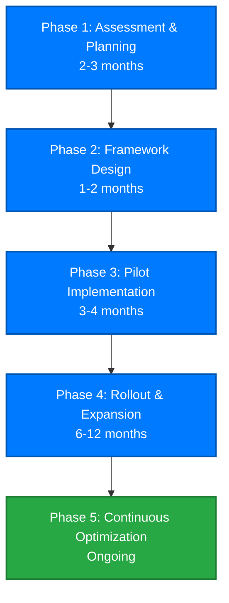
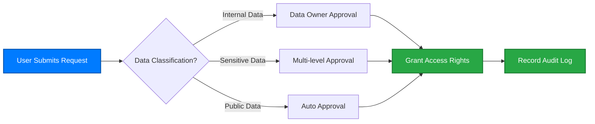
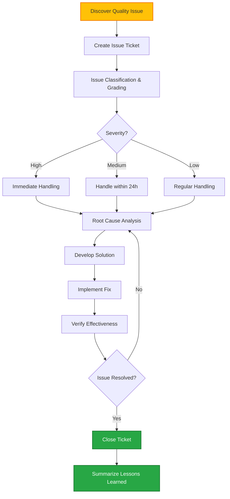
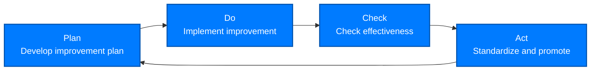

# Data Governance Implementation Guide

Successfully implementing data governance requires a systematic approach and phased advancement strategy. This guide provides actionable steps and best practices to help your enterprise establish an effective data governance system.

::: tip Core Principles
Data governance is a continuous journey, not a one-time project. It is recommended to adopt a **progressive** and **iterative** implementation approach, starting with small-scale pilots and gradually expanding.
:::

## Implementation Roadmap



## Phase 1: Assessment & Planning (2-3 Months)

### 1.1 Current State Assessment

Comprehensively assess the current data management status of the enterprise.

#### Assessment Dimensions

**Data Asset Inventory:**

-   What data sources and systems exist?
-   Data volume and growth trends?
-   What are the key business data?
-   Distribution of sensitive data?

**Data Quality Assessment:**

-   What are the current data quality issues?
-   Impact of data quality issues on business?
-   Root causes of data quality issues?

**Organization & Processes:**

-   Are there data-related roles and responsibilities?
-   Are there data management policies and processes?
-   How are data-related decisions made?

**Technical Capabilities:**

-   Existing data management tools?
-   IT infrastructure maturity?
-   Data management capabilities of technical teams?

**Compliance Status:**

-   Which laws and regulations need to be complied with?
-   Current compliance gaps?
-   Potential compliance risks?

#### Assessment Methods

<div class="feature-cards">
  <FeatureCard 
    icon="📋"
    title="Questionnaire Survey" 
    description="Distribute questionnaires to business and IT departments to collect feedback on data issues."
  />
  <FeatureCard 
    icon="💬"
    title="Interviews & Discussions" 
    description="Conduct in-depth interviews with key stakeholders to understand pain points and expectations."
  />
  <FeatureCard 
    icon="🔍"
    title="Technical Scanning" 
    description="Use tools to scan data assets and discover data quality and security issues."
  />
  <FeatureCard 
    icon="📊"
    title="Maturity Assessment" 
    description="Assess data management maturity referring to frameworks like DAMA and CMMI."
  />
</div>

#### Assessment Output

-   **Data Asset Inventory**: All data sources and key data entities
-   **Issue List**: Prioritized list of data issues
-   **Gap Analysis Report**: Gaps between current state and target
-   **Maturity Score**: Maturity scores for each dimension

### 1.2 Strategic Planning

Based on assessment results, formulate data governance strategy.

#### Define Objectives

Set SMART objectives (Specific, Measurable, Achievable, Relevant, Time-bound):

**Example Objectives:**

-   ✅ Within 12 months, core business data quality accuracy reaches 98% or above
-   ✅ Within 6 months, 100% of sensitive data implements access control and encryption
-   ✅ Establish enterprise-level data catalog covering 80% of key data assets
-   ✅ Achieve GDPR compliance and pass external audit

#### Determine Scope

**Recommended to start small:**

-   Select 1-2 business domains for pilot (e.g., customer data, product data)
-   Focus on the most painful data quality issues
-   Choose scenarios with high impact and moderate complexity

#### Secure Support

Data governance requires high-level support and cross-departmental collaboration:

-   Report to senior management to secure resource support
-   Identify Executive Sponsor
-   Form cross-departmental advancement team
-   Develop communication plan to manage change

#### Budget Planning

Typical data governance project cost structure:

| Cost Item             | Percentage | Description                                     |
| --------------------- | ---------- | ----------------------------------------------- |
| **Labor Costs**       | 40-50%     | Project team, consulting services, training     |
| **Tools & Platforms** | 30-40%     | Data catalog, data quality, MDM and other tools |
| **Infrastructure**    | 10-15%     | Servers, storage, network                       |
| **Other**             | 5-10%      | Travel, office, external audit                  |

::: warning Budget Recommendations

-   Small and medium enterprises: $500K - $1.5M
-   Large enterprises: $2M - $5M+
-   Remember to reserve 20% contingency budget
    :::

### 1.3 Develop Roadmap

Break down objectives into executable milestones and tasks.

**Typical 18-Month Roadmap:**

| Time    | Phase                      | Main Tasks                                                             | Outcomes               |
| ------- | -------------------------- | ---------------------------------------------------------------------- | ---------------------- |
| M1-M3   | Assessment & Planning      | Current state assessment, strategy formulation                         | Implementation roadmap |
| M4-M5   | Framework Design           | Organizational structure, policies & processes, technical architecture | Governance framework   |
| M6-M9   | Pilot Implementation       | Tool deployment, data domain pilot                                     | Successful pilot       |
| M10-M15 | Rollout & Expansion        | Comprehensive rollout, training & enablement                           | Full coverage          |
| M16-M18 | Optimization & Enhancement | Process optimization, capability improvement                           | Continuous improvement |

## Phase 2: Framework Design (1-2 Months)

### 2.1 Organizational Structure Design

Establish clear data governance organizational structure and role responsibilities.

#### Typical Organizational Structure

```
Data Governance Committee (Steering Committee)
    |
Data Governance Office
    |
    ├── Data Owners
    |     └── Business Department Heads
    |
    ├── Data Stewards
    |     ├── Business Data Stewards
    |     └── Technical Data Stewards
    |
    └── Data Consumers
          └── All Employees
```

#### Roles and Responsibilities (RACI Matrix)

| Activity                      | Governance Committee | Governance Office | Data Owners | Data Stewards | IT Team |
| ----------------------------- | -------------------- | ----------------- | ----------- | ------------- | ------- |
| Data strategy formulation     | **A**                | R                 | C           | C             | I       |
| Data policy approval          | **A**                | R                 | C           | I             | I       |
| Data standards formulation    | C                    | **A**             | R           | R             | C       |
| Data quality monitoring       | I                    | C                 | **A**       | R             | R       |
| Tool technical implementation | I                    | C                 | C           | C             | **R/A** |
| Issue handling                | I                    | C                 | **A**       | R             | R       |

**Legend:** R=Responsible, A=Accountable, C=Consulted, I=Informed

#### Staffing

**Core Governance Office Team (5-8 people):**

-   Data Governance Director × 1
-   Business Data Stewards × 2-3
-   Technical Data Stewards × 2-3
-   Project Manager × 1

### 2.2 Policy and Standards Development

Establish the "constitution" and "laws" of data governance.

#### Core Policy Documents

**1. Data Governance Policy**

-   Data governance vision and principles
-   Organizational structure and role responsibilities
-   Decision-making mechanisms and escalation paths

**2. Data Management Policy**

-   Data lifecycle management
-   Data quality management
-   Data security and privacy
-   Metadata management

**3. Data Usage Policy**

-   Data access request process
-   Data usage norms
-   Prohibited behaviors (e.g., unauthorized downloading of sensitive data)

**4. Data Security Policy**

-   Data classification and grading standards
-   Access control rules
-   Encryption and masking requirements
-   Audit and monitoring

#### Data Standards

**Naming Conventions:**

```
# Table naming
<business_domain>_<entity>_<type>
Example: crm_customer_master

# Field naming
<entity>_<attribute>_<modifier>
Example: customer_id, customer_name, customer_create_date
```

**Data Type Standards:**

-   Date/Time: ISO 8601 format (YYYY-MM-DD HH:MM:SS)
-   Currency: Unified currency codes (e.g., CNY, USD)
-   Country/Region: ISO 3166-1 codes (e.g., CN, US)
-   Phone Numbers: E.164 format

**Data Quality Rules:**

-   Mandatory field list
-   Uniqueness constraints
-   Value domain ranges
-   Format requirements
-   Logical consistency

### 2.3 Process Design

Establish standardized data management processes.

#### Core Processes

**1. Data Access Request Process**



**2. Data Quality Issue Handling Process**



**3. New Data Source Onboarding Process**

-   Business requirement review
-   Data source assessment (quality, security, compliance)
-   Technical solution design
-   Development and testing
-   Launch and acceptance
-   Metadata registration

**4. Data Change Management Process**

-   Change request
-   Impact analysis (based on data lineage)
-   Change approval
-   Change implementation
-   Change notification

### 2.4 Technical Architecture Design

Plan the technical support platform for data governance.

#### Technical Components

<div class="feature-cards">
  <FeatureCard 
    icon="📚"
    title="Data Catalog" 
    description="Metadata management, data asset search, data lineage visualization. Recommended tools: Collibra, Alation, Apache Atlas."
  />
  <FeatureCard 
    icon="✅"
    title="Data Quality" 
    description="Quality rule configuration, quality monitoring, quality reporting. Recommended tools: Informatica DQ, Talend DQ, Great Expectations."
  />
  <FeatureCard 
    icon="👑"
    title="Master Data Management" 
    description="Master data consolidation, matching, merging. Recommended tools: Informatica MDM, SAP MDG, Microsoft MDS."
  />
  <FeatureCard 
    icon="🔐"
    title="Data Security" 
    description="Access control, data encryption, masking, auditing. Recommended tools: Apache Ranger, Privacera, Immuta."
  />
  <FeatureCard 
    icon="📊"
    title="Data Lineage" 
    description="Automated lineage parsing, impact analysis. Recommended tools: Manta, Octopai, or integrated in data catalog."
  />
  <FeatureCard 
    icon="📋"
    title="Workflow Engine" 
    description="Data governance process automation. Recommended tools: Camunda, Activiti, or built-in workflow."
  />
</div>

#### Reference Architecture

```
┌─────────────────────────────────────────────────────┐
│                  User Interface Layer                 │
│  Data Catalog | Data Quality Dashboard | Workflow Portal | Analytics & Reports │
└─────────────────────────────────────────────────────┘
                        ↓
┌─────────────────────────────────────────────────────┐
│              Data Governance Services Layer           │
│  Metadata Mgmt | Quality Mgmt | Security Mgmt | Lineage Mgmt | Workflow Engine │
└─────────────────────────────────────────────────────┘
                        ↓
┌─────────────────────────────────────────────────────┐
│                  Data Storage Layer                   │
│  Metadata DB | Quality DB | Master Data DB | Audit Logs │
└─────────────────────────────────────────────────────┘
                        ↓
┌─────────────────────────────────────────────────────┐
│                  Data Source Layer                    │
│  Databases | Data Warehouse | Data Lake | Business Systems | File Systems │
└─────────────────────────────────────────────────────┘
```

#### Technology Selection Recommendations

**Open Source vs Commercial:**

| Option          | Advantages                                        | Disadvantages                                  | Suitable Scenarios                            |
| --------------- | ------------------------------------------------- | ---------------------------------------------- | --------------------------------------------- |
| **Open Source** | Low cost, high flexibility, community support     | Requires technical skills, complex integration | Strong technical capabilities, limited budget |
| **Commercial**  | Complete features, good support, rapid deployment | High cost, vendor lock-in                      | Quick results, sufficient budget              |
| **Hybrid**      | Balance cost and functionality                    | High architectural complexity                  | Most enterprises                              |

**Recommended Combinations:**

-   Startups/SMEs: Mainly open source (Apache Atlas + Great Expectations + Apache Ranger)
-   Large enterprises: Mainly commercial (Collibra + Informatica DQ + Informatica MDM)
-   Pragmatic approach: Hybrid (commercial data catalog + open source data quality)

## Phase 3: Pilot Implementation (3-4 Months)

### 3.1 Pilot Scope Selection

Choosing the right pilot scenario is crucial.

#### Selection Criteria

A good pilot should:

-   ✅ **High Business Value**: Solve actual pain points with obvious benefits
-   ✅ **Moderate Complexity**: Not too simple (unrepresentative) or too complex (high risk)
-   ✅ **Stakeholder Support**: Business departments willing to cooperate
-   ✅ **Good Scalability**: Successful experience can be replicated to other scenarios

#### Typical Pilot Scenarios

**Scenario 1: Customer Master Data Management**

-   Pain point: Multiple systems have duplicate customer data, inconsistent
-   Objective: Establish unified customer 360-degree view
-   Scope: Integrate customer data from CRM, ERP, e-commerce systems
-   Duration: 3 months
-   Value: Improve customer service quality, support precision marketing

**Scenario 2: Financial Data Quality Improvement**

-   Pain point: Financial report preparation time-consuming, data accuracy issues
-   Objective: Financial data quality reaches 98% or above
-   Scope: Data quality rules and monitoring for core financial metrics
-   Duration: 2 months
-   Value: Shorten month-end closing time, meet audit requirements

**Scenario 3: GDPR Compliance**

-   Pain point: Unclear where personal data is, difficult to respond to deletion requests
-   Objective: Identify all personal data, implement access control
-   Scope: Inventory PII data, implement data classification and permission management
-   Duration: 4 months
-   Value: Meet GDPR compliance, avoid fines

### 3.2 Tool Deployment

Deploy data governance tools in phases.

#### Deployment Steps

**1. Environment Preparation (1-2 weeks)**

-   Server, storage, network configuration
-   Database installation
-   Security configuration

**2. Tool Installation (1-2 weeks)**

-   Software installation and configuration
-   Integrate authentication system (AD/LDAP)
-   Basic functionality testing

**3. Data Onboarding (2-3 weeks)**

-   Connect data sources
-   Metadata collection
-   Data lineage parsing

**4. Rule Configuration (2-3 weeks)**

-   Configure data quality rules
-   Configure access control policies
-   Configure workflows

**5. User Training (1 week)**

-   Administrator training
-   End-user training
-   Documentation and video tutorials

### 3.3 Pilot Execution

Execute pilot project according to plan.

#### Execution Points

**Establish Project Management Mechanism:**

-   Weekly project meetings to track progress
-   Risk and issue management
-   Change control

**Data Quality Improvement:**

-   Data profiling to discover quality issues
-   Root cause analysis, develop improvement measures
-   Data cleaning and remediation
-   Continuous monitoring

**User Enablement:**

-   Hands-on training for key users
-   Establish help documentation and FAQ
-   Set up support hotline

**Effectiveness Measurement:**

-   Set baseline and target KPIs
-   Regularly measure and report progress
-   Collect user feedback

### 3.4 Pilot Summary

After pilot completion, comprehensively summarize lessons learned.

#### Evaluation Dimensions

-   ✅ Goal achievement (KPI completion)
-   ✅ User satisfaction
-   ✅ Business value realization
-   ✅ Technical solution feasibility
-   ✅ Process effectiveness

#### Output

-   **Pilot Summary Report**: Achievements, issues, recommendations
-   **Best Practices Documentation**: Reusable experiences
-   **Rollout Plan**: Next action steps

::: tip Success Criteria
Signs of successful pilot:

-   Achieve 80%+ of target KPIs
-   User satisfaction ≥4 points (5-point scale)
-   Business departments willing to continue rollout
-   Management recognizes value
    :::

## Phase 4: Rollout & Expansion (6-12 Months)

### 4.1 Rollout Strategy

From pilot to comprehensive rollout requires orderly strategy.

#### Rollout Paths

**Method 1: Rollout by Business Domain**

-   Customer domain → Product domain → Supply chain domain → Finance domain → ...
-   Each business domain implemented independently, 2-3 months duration

**Method 2: Rollout by Capability**

-   Data catalog → Data quality → Master data management → Data security → ...
-   Gradually add governance capabilities

**Method 3: Hybrid Rollout**

-   Horizontal: Cover more business domains
-   Vertical: Deepen governance capabilities
-   Most common approach

#### Rollout Pace

Recommended "wave rollout":

-   **Wave 1** (M1-M3): Expand to 2-3 new business domains
-   **Wave 2** (M4-M6): Expand to 3-5 more business domains
-   **Wave 3** (M7-M9): Fully cover all core business domains
-   **Wave 4** (M10-M12): Deepen and optimize

### 4.2 Scaling Challenges

New challenges will be encountered during rollout.

#### Common Challenges and Solutions

| Challenge                | Solutions                                                                                |
| ------------------------ | ---------------------------------------------------------------------------------------- |
| **Change Resistance**    | Senior support, training & communication, incentive mechanisms, quick wins               |
| **Resource Shortage**    | Priority management, external support, automation tools                                  |
| **Increased Complexity** | Simplify processes, standardized templates, knowledge management                         |
| **Tool Performance**     | Optimize configuration, horizontal scaling, distributed architecture                     |
| **Cultural Integration** | Continuous communication, exemplary demonstration, integrate into performance evaluation |

### 4.3 Organizational Enablement

Build enterprise data governance capabilities.

#### Training System

**1. Awareness Training (All Staff)**

-   What is data governance, why is it important
-   Everyone's responsibility
-   Duration: 1-2 hours

**2. Role Training (By Role)**

-   Data owner training (1 day)
-   Data steward training (3 days)
-   End-user training (2 hours)

**3. Technical Training (Technical Staff)**

-   Tool usage training
-   Administrator training
-   Development integration training

#### Data Culture Building

**Value Shaping:**

-   Data is an asset
-   Everyone is responsible for data quality
-   Data sharing creates value

**Behavior Guidance:**

-   Include data governance in performance evaluation
-   Establish data quality awards
-   Set benchmarks and role models

**Continuous Communication:**

-   Regularly share success stories
-   Data governance newsletter
-   Internal community and forum

## Phase 5: Continuous Optimization (Ongoing)

### 5.1 Monitoring and Measurement

Establish continuous monitoring and measurement mechanisms.

#### Key Indicator System

**Data Quality Metrics:**

-   Data accuracy rate
-   Data completeness rate
-   Data timeliness rate
-   Data consistency rate
-   Number of quality issues and resolution time

**Operational Metrics:**

-   Number of data assets
-   Data access count
-   Workflow processing time
-   User satisfaction

**Value Metrics:**

-   Cost savings
-   Efficiency improvement
-   Risk reduction
-   Business growth

**Compliance Metrics:**

-   Policy compliance rate
-   Audit findings count
-   Compliance training coverage

#### Dashboard Example

```
Data Governance Dashboard
┌─────────────────┬─────────────────┬─────────────────┐
│ Data Quality    │ Compliance      │ Business Value  │
│                 │ Status          │                 │
│ Overall: 92/100 │ Compliance: 98% │ Cost Savings:   │
│ ■■■■■■■■■□     │ ■■■■■■■■■□     │ $2.5M/year      │
│                 │                 │                 │
│ Issue Tickets:  │ Audit Findings: │ Efficiency:     │
│ 15 (5 high)     │ 3 (all fixed)   │ Improved 45%    │
└─────────────────┴─────────────────┴─────────────────┘

Data Asset Stats                   Monthly Activity
- Data Sources: 85                 - Active Users: 520
- Data Tables: 2,340               - Data Access: 12,450
- Key Metrics: 450                 - Issue Reports: 28
```

### 5.2 Continuous Improvement

Data governance is a process of constant optimization.

#### Improvement Cycle (PDCA)



#### Improvement Sources

-   Monitoring metric anomalies
-   User feedback and suggestions
-   Issue root cause analysis
-   Industry best practices
-   New technologies and tools
-   New business requirements

#### Regular Reviews

Establish regular review mechanism:

| Review                      | Frequency | Participants                   | Content                               |
| --------------------------- | --------- | ------------------------------ | ------------------------------------- |
| **Daily Operations Review** | Weekly    | Governance Office              | Ticket handling, issue tracking       |
| **Tactical Review**         | Monthly   | Data Stewards, Data Owners     | KPI review, process optimization      |
| **Strategic Review**        | Quarterly | Governance Committee           | Strategic adjustment, major decisions |
| **Annual Review**           | Yearly    | Senior Management, All Members | Annual summary, next year planning    |

### 5.3 Capability Advancement

From basic to advanced, continuously improve data governance capabilities.

#### Maturity Model

```
Level 5: Optimizing
  │  Continuous innovation, industry-leading, data-driven culture
  │
Level 4: Managed
  │  Quantitative management, predictive analysis, proactive optimization
  │
Level 3: Defined
  │  Standardized processes, tool support, comprehensive coverage
  │
Level 2: Repeatable
  │  Basic processes, successful pilot, partial coverage
  │
Level 1: Initial
  │  Ad hoc, chaotic, person-dependent
  │
```

**Advancement Path:**

-   From manual to automated
-   From reactive to proactive
-   From local to global
-   From management to enablement


---

## Next Steps

-   ⭐ [Learn about success factors](/en/implementation/success-factors)
-   ✅ [Use the implementation checklist](/en/implementation/checklist)
-   📖 [Return to implementation guide overview](/en/implementation/)
