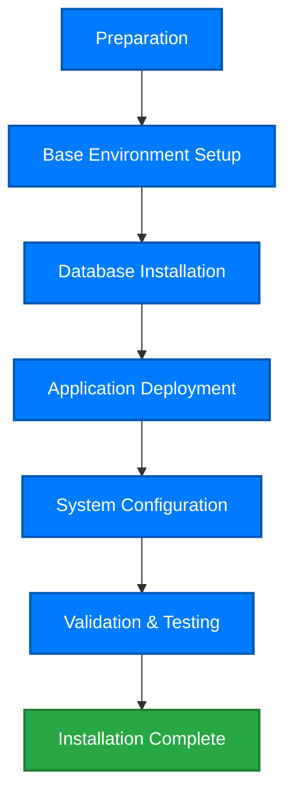

# Data Governance Product Installation Guide

This guide provides detailed instructions for installing and deploying the Data Governance Platform, helping you quickly and securely complete product installation and configuration.

::: tip Installation Tips
It is recommended to perform a test installation in a non-production environment first, verify the configuration is correct, and then deploy to production. The entire installation process takes approximately 2-4 hours.
:::

## Installation Overview

The Data Governance Platform uses a modular architecture and supports flexible deployment methods.



## System Requirements

### Hardware Requirements

#### Minimum Configuration (Test Environment)

| Component   | Requirements |
| ----------- | ------------ |
| **CPU**     | 4 cores      |
| **Memory**  | 16 GB RAM    |
| **Disk**    | 200 GB SSD   |
| **Network** | 100 Mbps     |

#### Recommended Configuration (Production Environment)

| Component          | Requirements          |
| ------------------ | --------------------- |
| **CPU**            | 16 cores              |
| **Memory**         | 64 GB RAM             |
| **Disk**           | 1 TB SSD (RAID 10)    |
| **Network**        | 1 Gbps                |
| **Backup Storage** | 2 TB (offsite backup) |

#### High Availability Configuration (Enterprise)

| Component               | Nodes                      | Per Node Configuration |
| ----------------------- | -------------------------- | ---------------------- |
| **Application Servers** | 3+                         | 16 cores, 64GB RAM     |
| **Database Servers**    | 3 (Primary+Replica+Backup) | 16 cores, 128GB RAM    |
| **Load Balancers**      | 2                          | 8 cores, 16GB RAM      |
| **Cache Servers**       | 3                          | 8 cores, 32GB RAM      |

### Software Requirements

#### Operating System

Supported operating systems (64-bit):

-   ✅ **Linux**
    -   Red Hat Enterprise Linux 8.x / 9.x
    -   CentOS 8.x / Stream 9
    -   Ubuntu 20.04 LTS / 22.04 LTS
    -   SUSE Linux Enterprise Server 15
-   ✅ **Windows Server**
    -   Windows Server 2019
    -   Windows Server 2022
-   ⚠️ **Other Unix Systems** (require additional validation)
    -   Oracle Linux 8.x
    -   Debian 11+

::: tip Recommendation
For production environments, **Linux systems** (RHEL or Ubuntu LTS) are strongly recommended for better stability and performance.
:::

#### Database

Supported databases (for storing metadata and configuration):

| Database          | Version     | Recommended Scenario   |
| ----------------- | ----------- | ---------------------- |
| **PostgreSQL** ⭐ | 12.x - 15.x | Preferred, open source |
| **MySQL**         | 8.0.x       | Good compatibility     |
| **Oracle**        | 12c - 19c   | Large enterprises      |
| **SQL Server**    | 2017 - 2022 | Windows environments   |

#### Java Runtime

-   **JDK/JRE**: 11.x or 17.x (LTS versions)
-   Recommended: OpenJDK 17 or Oracle JDK 17

#### Other Dependencies

-   **Python**: 3.8+ (for data quality check scripts)
-   **Node.js**: 16.x+ (for web interface, optional)
-   **Redis**: 6.x+ (for caching and session management)
-   **Elasticsearch**: 7.x / 8.x (for full-text search, optional)

### Network Requirements

#### Port Planning

| Service           | Default Port             | Protocol  | Description               |
| ----------------- | ------------------------ | --------- | ------------------------- |
| **Web Console**   | 8080                     | HTTP      | Customizable              |
| **HTTPS Console** | 8443                     | HTTPS     | Required for production   |
| **API Service**   | 9090                     | HTTP/REST | Application integration   |
| **Database**      | 5432 (PG) / 3306 (MySQL) | TCP       | Depends on database type  |
| **Redis**         | 6379                     | TCP       | Cache service             |
| **Elasticsearch** | 9200                     | HTTP      | Search service (optional) |

#### Firewall Rules

Ensure the following ports are open in the firewall:

```bash
# Linux (firewalld)
firewall-cmd --permanent --add-port=8080/tcp
firewall-cmd --permanent --add-port=8443/tcp
firewall-cmd --permanent --add-port=9090/tcp
firewall-cmd --reload

# Linux (iptables)
iptables -A INPUT -p tcp --dport 8080 -j ACCEPT
iptables -A INPUT -p tcp --dport 8443 -j ACCEPT
service iptables save
```

### Browser Requirements

Web console supports the following browsers (latest two major versions):

-   ✅ Google Chrome 100+
-   ✅ Microsoft Edge 100+
-   ✅ Mozilla Firefox 100+
-   ✅ Safari 15+ (macOS)
-   ⚠️ IE 11 (limited support, not recommended)

---

## Phase 1: Preparation (30 minutes)

### 1.1 Obtain Installation Package

#### Download Installation Files

Obtain the following files from official channels:

1. **Main Package**: `data-governance-platform-v2.5.0.tar.gz`
2. **License File**: `license.key` (contact sales)
3. **Installation Guide**: `installation-guide.pdf`
4. **Sample Configs**: `config-samples.zip`

#### File Verification

Verify the integrity of downloaded files:

```bash
# MD5 checksum
md5sum data-governance-platform-v2.5.0.tar.gz
# Should output: a3b5c2d1e4f567890abcdef123456789

# SHA256 checksum (more secure)
sha256sum data-governance-platform-v2.5.0.tar.gz
```

### 1.2 Create System User

Create a dedicated user to run the application (do not use root):

```bash
# Linux systems
sudo useradd -m -s /bin/bash dgadmin
sudo passwd dgadmin

# Set user permissions
sudo usermod -aG wheel dgadmin  # RHEL/CentOS
# or
sudo usermod -aG sudo dgadmin   # Ubuntu/Debian
```

### 1.3 Prepare Installation Directories

```bash
# Create directory structure
sudo mkdir -p /opt/data-governance/{app,data,logs,config,backup}

# Set permissions
sudo chown -R dgadmin:dgadmin /opt/data-governance
sudo chmod 755 /opt/data-governance

# Switch to installation user
su - dgadmin
cd /opt/data-governance
```

### 1.4 Upload Installation Package

Upload the downloaded package to the server:

```bash
# Using scp
scp data-governance-platform-v2.5.0.tar.gz dgadmin@server-ip:/opt/data-governance/

# Or use SFTP/FTP tools (e.g., WinSCP, FileZilla)
```

### 1.5 Extract Installation Package

```bash
cd /opt/data-governance
tar -xzvf data-governance-platform-v2.5.0.tar.gz
cd data-governance-platform-v2.5.0
ls -la
# Should see: bin/ config/ lib/ scripts/ docs/ LICENSE
```

---

## Phase 2: Base Environment Setup (45 minutes)

### 2.1 Install Java JDK

#### Linux (RHEL/CentOS)

```bash
# Install OpenJDK 17
sudo yum install java-17-openjdk java-17-openjdk-devel -y

# Verify installation
java -version
javac -version
```

#### Linux (Ubuntu/Debian)

```bash
# Update package index
sudo apt update

# Install OpenJDK 17
sudo apt install openjdk-17-jdk -y

# Verify installation
java -version
```

#### Configure JAVA_HOME

```bash
# Find Java installation path
sudo update-alternatives --config java
# Example output: /usr/lib/jvm/java-17-openjdk-amd64

# Edit environment variables
sudo vi /etc/profile.d/java.sh

# Add the following
export JAVA_HOME=/usr/lib/jvm/java-17-openjdk-amd64
export PATH=$JAVA_HOME/bin:$PATH

# Apply configuration
source /etc/profile.d/java.sh

# Verify
echo $JAVA_HOME
```

### 2.2 Install PostgreSQL Database

#### Linux (RHEL/CentOS)

```bash
# Add PostgreSQL official repository
sudo yum install -y https://download.postgresql.org/pub/repos/yum/reporpms/EL-8-x86_64/pgdg-redhat-repo-latest.noarch.rpm

# Disable built-in PostgreSQL module
sudo dnf -qy module disable postgresql

# Install PostgreSQL 14
sudo yum install -y postgresql14-server postgresql14-contrib

# Initialize database
sudo /usr/pgsql-14/bin/postgresql-14-setup initdb

# Start service
sudo systemctl enable postgresql-14
sudo systemctl start postgresql-14
sudo systemctl status postgresql-14
```

#### Linux (Ubuntu/Debian)

```bash
# Install PostgreSQL
sudo apt install postgresql-14 postgresql-contrib-14 -y

# Check service status
sudo systemctl status postgresql
```

#### Configure PostgreSQL

```bash
# Switch to postgres user
sudo -i -u postgres

# Enter PostgreSQL command line
psql

-- Change postgres user password
ALTER USER postgres PASSWORD 'StrongP@ssw0rd!';

-- Create dedicated database for data governance
CREATE DATABASE datagovernance ENCODING 'UTF8';

-- Create dedicated user
CREATE USER dguser WITH PASSWORD 'DG_P@ssw0rd123';

-- Grant permissions
GRANT ALL PRIVILEGES ON DATABASE datagovernance TO dguser;

-- Exit
\q
exit
```

#### Configure Remote Access (if needed)

```bash
# Edit postgresql.conf
sudo vi /var/lib/pgsql/14/data/postgresql.conf

# Change listen address
listen_addresses = '*'  # or specific IP

# Edit pg_hba.conf
sudo vi /var/lib/pgsql/14/data/pg_hba.conf

# Add access rules (adjust based on network)
host    datagovernance    dguser    10.0.0.0/8    md5
host    all               all       127.0.0.1/32  md5

# Restart service
sudo systemctl restart postgresql-14
```

### 2.3 Install Redis (Optional but Recommended)

```bash
# RHEL/CentOS
sudo yum install redis -y

# Ubuntu/Debian
sudo apt install redis-server -y

# Start service
sudo systemctl enable redis
sudo systemctl start redis

# Verify
redis-cli ping
# Should return: PONG
```

#### Configure Redis

```bash
# Edit configuration file
sudo vi /etc/redis/redis.conf

# Recommended changes:
# 1. Set password
requirepass YourRedisPassword123

# 2. Restrict listen address (production)
bind 127.0.0.1

# 3. Set max memory
maxmemory 4gb
maxmemory-policy allkeys-lru

# Restart service
sudo systemctl restart redis
```

### 2.4 Install Python 3 (Optional)

```bash
# RHEL/CentOS
sudo yum install python3 python3-pip -y

# Ubuntu/Debian
sudo apt install python3 python3-pip -y

# Verify
python3 --version
pip3 --version
```

---

## Phase 3: Database Initialization (30 minutes)

### 3.1 Import Database Schema

```bash
# Go to installation directory
cd /opt/data-governance/data-governance-platform-v2.5.0/scripts/database

# Check available scripts
ls -l
# Should see:
# - postgresql_schema.sql
# - postgresql_data.sql
# - mysql_schema.sql (if using MySQL)

# Import Schema (PostgreSQL)
psql -h localhost -U dguser -d datagovernance -f postgresql_schema.sql

# Enter password, wait for import to complete

# Import initial data
psql -h localhost -U dguser -d datagovernance -f postgresql_data.sql
```

### 3.2 Verify Database Installation

```bash
# Connect to database
psql -h localhost -U dguser -d datagovernance

-- View created tables
\dt

-- Should see similar output:
--  Schema |       Name        | Type  | Owner
-- --------+-------------------+-------+--------
--  public | dg_users          | table | dguser
--  public | dg_metadata       | table | dguser
--  public | dg_data_quality   | table | dguser
--  public | dg_lineage        | table | dguser
--  ...

-- Check initial data
SELECT COUNT(*) FROM dg_users;
-- Should return at least 1 (admin user)

\q
```

### 3.3 Database Performance Tuning (Production)

```bash
# Edit postgresql.conf
sudo vi /var/lib/pgsql/14/data/postgresql.conf

# Adjust parameters based on hardware (example: 64GB RAM server)
shared_buffers = 16GB
effective_cache_size = 48GB
maintenance_work_mem = 2GB
work_mem = 64MB
max_connections = 200
checkpoint_completion_target = 0.9
wal_buffers = 16MB
random_page_cost = 1.1
effective_io_concurrency = 200

# Restart database
sudo systemctl restart postgresql-14
```

---

## Phase 4: Application Deployment (60 minutes)

### 4.1 Configure Application Parameters

#### Edit Main Configuration File

```bash
cd /opt/data-governance/data-governance-platform-v2.5.0
cp config/application.properties.template config/application.properties
vi config/application.properties
```

#### Key Configuration Items

```properties
# ===== Server Configuration =====
server.host=0.0.0.0
server.port=8080
server.https.enabled=true
server.https.port=8443
server.context-path=/dg

# ===== Database Configuration =====
db.type=postgresql
db.host=localhost
db.port=5432
db.name=datagovernance
db.username=dguser
db.password=DG_P@ssw0rd123
db.pool.max=50
db.pool.min=10

# ===== Redis Configuration =====
redis.enabled=true
redis.host=localhost
redis.port=6379
redis.password=YourRedisPassword123
redis.database=0

# ===== Logging Configuration =====
log.level=INFO
log.path=/opt/data-governance/logs
log.max.size=100MB
log.max.history=30

# ===== Security Configuration =====
security.jwt.secret=YourJWTSecretKey_ChangeMe_32CharactersMin
security.jwt.expiration=86400
security.session.timeout=3600

# ===== License Configuration =====
license.file=/opt/data-governance/config/license.key

# ===== File Storage Configuration =====
storage.type=local
storage.local.path=/opt/data-governance/data
storage.max.upload.size=500MB
```

### 4.2 Configure SSL Certificate (Required for Production)

#### Generate Self-Signed Certificate (Test Environment)

```bash
cd /opt/data-governance/config

# Generate keystore
keytool -genkeypair -alias datagovernance \
  -keyalg RSA -keysize 2048 \
  -storetype PKCS12 \
  -keystore keystore.p12 \
  -validity 3650 \
  -storepass changeit

# Enter certificate information
# CN: Server domain or IP
# OU: Organization unit
# O: Organization name
# L: City
# ST: State/Province
# C: Country code
```

#### Use Official SSL Certificate (Production)

```bash
# After obtaining certificate from CA, import to keystore
keytool -importcert -alias root -file ca-root.crt -keystore keystore.p12 -storepass changeit
keytool -importcert -alias intermediate -file ca-intermediate.crt -keystore keystore.p12 -storepass changeit
keytool -importcert -alias server -file server.crt -keystore keystore.p12 -storepass changeit
```

#### Update Configuration File

```properties
# application.properties
server.ssl.enabled=true
server.ssl.key-store=/opt/data-governance/config/keystore.p12
server.ssl.key-store-password=changeit
server.ssl.key-store-type=PKCS12
server.ssl.key-alias=datagovernance
```

### 4.3 Install License

```bash
# Copy license file to config directory
cp /path/to/license.key /opt/data-governance/config/

# Validate license
cd /opt/data-governance/data-governance-platform-v2.5.0
./bin/validate-license.sh /opt/data-governance/config/license.key

# Should output:
# License validation successful
# Licensed to: Your Company Name
# Expiration date: 2025-12-31
# Max users: 500
```

### 4.4 Start Application Service

#### Manual Start (Testing)

```bash
cd /opt/data-governance/data-governance-platform-v2.5.0

# Foreground start (view logs)
./bin/start.sh

# Background start
nohup ./bin/start.sh > /dev/null 2>&1 &

# View startup logs
tail -f /opt/data-governance/logs/application.log
```

#### Configure Systemd Service (Recommended)

```bash
# Create service file
sudo vi /etc/systemd/system/data-governance.service
```

```ini
[Unit]
Description=Data Governance Platform
After=network.target postgresql-14.service redis.service

[Service]
Type=forking
User=dgadmin
Group=dgadmin
Environment="JAVA_HOME=/usr/lib/jvm/java-17-openjdk-amd64"
WorkingDirectory=/opt/data-governance/data-governance-platform-v2.5.0
ExecStart=/opt/data-governance/data-governance-platform-v2.5.0/bin/start.sh
ExecStop=/opt/data-governance/data-governance-platform-v2.5.0/bin/stop.sh
Restart=on-failure
RestartSec=10
StandardOutput=journal
StandardError=journal

[Install]
WantedBy=multi-user.target
```

```bash
# Reload systemd
sudo systemctl daemon-reload

# Start service
sudo systemctl start data-governance

# Enable auto-start on boot
sudo systemctl enable data-governance

# Check status
sudo systemctl status data-governance
```

### 4.5 Verify Service Startup

```bash
# Check process
ps aux | grep data-governance

# Check ports
netstat -tulpn | grep 8080
netstat -tulpn | grep 8443

# Test HTTP access
curl -I http://localhost:8080/dg/health

# Should return: HTTP/1.1 200 OK

# Test HTTPS access (ignore certificate warning)
curl -k -I https://localhost:8443/dg/health
```

---

## Phase 5: System Configuration (45 minutes)

### 5.1 Initial Login

#### Access Web Console

Open browser and visit:

```
https://your-server-ip:8443/dg
```

#### Default Administrator Account

```
Username: admin
Password: Admin@123  (Must change on first login)
```

### 5.2 Change Administrator Password

1. After login, click profile icon in top right
2. Select "Account Settings"
3. Go to "Security Settings" tab
4. Enter current password and new password
5. Password requirements:
    - At least 12 characters
    - Contains uppercase, lowercase, numbers, special characters
    - Cannot be same as username

### 5.3 Configure SMTP Email Service

Navigate to: **System Settings > Email Configuration**

```yaml
SMTP Server: smtp.company.com
Port: 587 (TLS) or 465 (SSL)
From Address: noreply@company.com
From Name: Data Governance Platform
Auth Username: smtp-user@company.com
Auth Password: ********
Enable TLS: Yes
```

Click "Test Connection" to verify configuration.

### 5.4 Configure LDAP/AD Integration (Optional)

Navigate to: **System Settings > Authentication > LDAP/AD**

```yaml
Enable LDAP: Yes
Server URL: ldap://ldap.company.com:389
Bind DN: CN=ldap-bind,OU=ServiceAccounts,DC=company,DC=com
Bind Password: ********
Base DN: DC=company,DC=com
User Search Filter: (&(objectClass=user)(sAMAccountName={0}))
User Attribute Mapping:
  Username: sAMAccountName
  Email: mail
  Display Name: displayName
  Department: department
Group Base DN: OU=Groups,DC=company,DC=com
Group Search Filter: (&(objectClass=group)(member={0}))
```

Click "Test Connection" and try logging in with LDAP user.

### 5.5 Configure Data Sources

#### Add First Data Source

Navigate to: **Data Source Management > New Data Source**

Example: PostgreSQL Database

```yaml
Data Source Name: PostgreSQL Production DB
Type: PostgreSQL
Host: postgres.company.com
Port: 5432
Database: production_db
Username: readonly_user
Password: ********
Connection Pool Size: 20
SSL Mode: require
Description: Production primary database
```

Click "Test Connection", then "Save" if successful.

#### Configure Metadata Collection

1. Select the newly created data source
2. Click "Metadata Collection"
3. Configure collection schedule:
    - Frequency: Daily at 02:00
    - Scope: All schemas
    - Include tables, views, columns
    - Include indexes and constraints
    - Collect data samples: Yes (first 1000 rows)
4. Click "Collect Now" for initial collection

### 5.6 Configure Data Quality Rules

Navigate to: **Data Quality > Rule Templates**

#### Create Common Quality Rules

**Rule 1: Null Check**

```yaml
Rule Name: Core Field Non-Null Check
Type: Completeness Check
Logic: Field value is not NULL
Applies To: Fields marked as "Required"
Severity: High
```

**Rule 2: Format Validation**

```yaml
Rule Name: Email Format Validation
Type: Format Check
Logic: Regex ^[a-zA-Z0-9._%+-]+@[a-zA-Z0-9.-]+\.[a-zA-Z]{2,}$
Applies To: email fields
Severity: Medium
```

**Rule 3: Value Range Check**

```yaml
Rule Name: Age Reasonableness Check
Type: Range Check
Logic: Value between 0 - 150
Applies To: age, birth_age fields
Severity: Medium
```

### 5.7 Configure Users and Permissions

#### Create Roles

Navigate to: **System Settings > Role Management > New Role**

**Data Administrator Role**

```yaml
Role Name: Data Administrator
Role Code: DATA_ADMIN
Description: Responsible for data quality monitoring and metadata management
Permissions:
    - Data Catalog: View, Edit
    - Data Quality: View, Configure Rules, Execute Checks
    - Data Lineage: View
    - Data Source Management: View
    - User Management: None
```

**Business User Role**

```yaml
Role Name: Business User
Role Code: BUSINESS_USER
Description: View data catalog and quality reports
Permissions:
    - Data Catalog: View
    - Data Quality: View Reports
    - Data Lineage: View
    - Data Source Management: None
    - User Management: None
```

#### Create Users

Navigate to: **System Settings > User Management > New User**

```yaml
Username: john.smith
Full Name: John Smith
Email: john.smith@company.com
Department: Data Management
Role: Data Administrator
Status: Active
Initial Password: TempP@ss123 (must change on first login)
```

---

## Phase 6: Validation & Testing (30 minutes)

### 6.1 Functional Validation Checklist

#### ✅ Basic Functionality Tests

-   [ ] Login works normally
-   [ ] Password change successful
-   [ ] LDAP/AD authentication works (if configured)
-   [ ] Email sending works (test password recovery)

#### ✅ Data Source Connection Tests

-   [ ] Add data source successful
-   [ ] Test connection successful
-   [ ] Metadata collection successful
-   [ ] Data preview works

#### ✅ Data Quality Tests

-   [ ] Create quality rule successful
-   [ ] Execute quality check successful
-   [ ] View quality report works
-   [ ] Quality alert sent successfully

#### ✅ Data Lineage Tests

-   [ ] Lineage parsing successful
-   [ ] Lineage visualization works
-   [ ] Impact analysis works

#### ✅ Permission Tests

-   [ ] Role permissions effective
-   [ ] Data-level permissions work
-   [ ] User switching works

### 6.2 Performance Benchmark Tests

#### Metadata Collection Performance

```bash
# Collecting metadata for 1000 tables
Time: < 5 minutes
CPU Usage: < 60%
Memory Usage: < 4GB
```

#### Web Interface Response Time

-   Homepage load: < 2 seconds
-   Data catalog search: < 1 second
-   Lineage graph rendering: < 3 seconds
-   Quality report generation: < 5 seconds

### 6.3 Log Inspection

```bash
# Check application logs
tail -100 /opt/data-governance/logs/application.log

# Should have no ERROR or FATAL level logs

# Check database connection pool
grep "connection pool" /opt/data-governance/logs/application.log

# Check performance metrics
grep "performance" /opt/data-governance/logs/application.log
```

### 6.4 System Health Check

Access health check endpoint:

```bash
curl -k https://localhost:8443/dg/actuator/health

# Should return:
{
  "status": "UP",
  "components": {
    "database": {"status": "UP"},
    "redis": {"status": "UP"},
    "diskSpace": {"status": "UP"}
  }
}
```

---

## Phase 7: Backup and Monitoring Setup (30 minutes)

### 7.1 Configure Database Backup

#### Create Backup Script

```bash
# Create backup directory
sudo mkdir -p /opt/data-governance/backup/database
sudo chown dgadmin:dgadmin /opt/data-governance/backup/database

# Create backup script
vi /opt/data-governance/scripts/backup-database.sh
```

```bash
#!/bin/bash
# Database backup script

BACKUP_DIR="/opt/data-governance/backup/database"
DATE=$(date +%Y%m%d_%H%M%S)
DB_NAME="datagovernance"
DB_USER="dguser"
BACKUP_FILE="$BACKUP_DIR/dg_backup_$DATE.sql.gz"
RETENTION_DAYS=30

# Execute backup
pg_dump -h localhost -U $DB_USER -d $DB_NAME | gzip > $BACKUP_FILE

# Check if backup succeeded
if [ $? -eq 0 ]; then
    echo "$(date) - Backup successful: $BACKUP_FILE"

    # Delete backups older than retention period
    find $BACKUP_DIR -name "dg_backup_*.sql.gz" -mtime +$RETENTION_DAYS -delete
else
    echo "$(date) - Backup failed!" >&2
    exit 1
fi
```

```bash
# Set execute permissions
chmod +x /opt/data-governance/scripts/backup-database.sh

# Test backup
./backup-database.sh
```

#### Configure Scheduled Backup

```bash
# Edit crontab
crontab -e

# Add daily automatic backup at 1 AM
0 1 * * * /opt/data-governance/scripts/backup-database.sh >> /opt/data-governance/logs/backup.log 2>&1
```

### 7.2 Configure Application Monitoring

#### Use Built-in Monitoring

Visit: `https://server-ip:8443/dg/actuator`

Available endpoints:

-   `/actuator/health` - Health status
-   `/actuator/metrics` - Performance metrics
-   `/actuator/info` - System information

#### Integrate Prometheus (Optional)

```properties
# application.properties
management.endpoints.web.exposure.include=health,metrics,prometheus
management.metrics.export.prometheus.enabled=true
```

Configure Prometheus scraping:

```yaml
# prometheus.yml
scrape_configs:
    - job_name: 'data-governance'
      static_configs:
          - targets: ['server-ip:8080']
      metrics_path: '/dg/actuator/prometheus'
```

### 7.3 Configure Log Rotation

```bash
# Create logrotate configuration
sudo vi /etc/logrotate.d/data-governance
```

```
/opt/data-governance/logs/*.log {
    daily
    missingok
    rotate 30
    compress
    delaycompress
    notifempty
    create 0644 dgadmin dgadmin
    sharedscripts
    postrotate
        /bin/kill -USR1 $(cat /opt/data-governance/data-governance-platform-v2.5.0/run.pid 2>/dev/null) 2>/dev/null || true
    endscript
}
```

---

## Installation Completion Checklist

### ✅ Installation Verification

-   [ ] All services started normally
-   [ ] Web console accessible
-   [ ] Administrator can login
-   [ ] Database connection normal
-   [ ] Redis connection normal (if enabled)
-   [ ] License validated successfully

### ✅ Configuration Verification

-   [ ] Administrator password changed
-   [ ] SMTP email configured
-   [ ] LDAP/AD integration complete (if needed)
-   [ ] At least one data source configured
-   [ ] Roles and permissions configured
-   [ ] SSL certificate configured

### ✅ Security Hardening

-   [ ] All default passwords changed
-   [ ] Firewall rules configured
-   [ ] Database access restricted
-   [ ] Audit logging enabled
-   [ ] File permissions set correctly

### ✅ Backup and Monitoring

-   [ ] Database backup script configured
-   [ ] Scheduled backup tasks set
-   [ ] Log rotation configured
-   [ ] Monitoring endpoints accessible
-   [ ] Alert notifications configured

---

## Troubleshooting

### Common Issues

#### Issue 1: Service Won't Start

**Symptoms**: Service exits immediately after running start.sh

**Troubleshooting Steps**:

```bash
# 1. Check logs
tail -100 /opt/data-governance/logs/application.log

# 2. Check Java environment
echo $JAVA_HOME
java -version

# 3. Check port usage
netstat -tulpn | grep 8080

# 4. Check file permissions
ls -l /opt/data-governance/data-governance-platform-v2.5.0/bin/start.sh
```

**Solutions**:

-   Ensure JAVA_HOME is set correctly
-   Check ports are not in use
-   Ensure scripts have execute permissions: `chmod +x bin/*.sh`
-   Review detailed error logs

#### Issue 2: Database Connection Failed

**Symptoms**: Logs show "Unable to connect to database"

**Troubleshooting Steps**:

```bash
# 1. Test database connection
psql -h localhost -U dguser -d datagovernance

# 2. Check database service
sudo systemctl status postgresql-14

# 3. Check configuration file
cat config/application.properties | grep db.

# 4. Check firewall
sudo firewall-cmd --list-all
```

**Solutions**:

-   Confirm database service is running
-   Verify username, password, database name are correct
-   Check pg_hba.conf allows connection
-   Verify firewall rules

#### Issue 3: Cannot Access Web Interface

**Symptoms**: Browser shows "Unable to connect to server"

**Troubleshooting Steps**:

```bash
# 1. Check service status
sudo systemctl status data-governance

# 2. Check port listening
netstat -tulpn | grep 8443

# 3. Test local access
curl -k https://localhost:8443/dg/health

# 4. Check firewall
sudo firewall-cmd --list-ports
```

**Solutions**:

-   Ensure service is running
-   Open firewall ports
-   Check SSL certificate configuration
-   Review application error logs

#### Issue 4: License Validation Failed

**Symptoms**: "License validation failed" error

**Troubleshooting Steps**:

```bash
# 1. Check license file
ls -l /opt/data-governance/config/license.key

# 2. Validate license
./bin/validate-license.sh /opt/data-governance/config/license.key

# 3. Check system time
date
```

**Solutions**:

-   Confirm license file path is correct
-   Check if license is expired
-   Synchronize system time (license validation depends on system time)
-   Contact support for new license

#### Issue 5: Out of Memory

**Symptoms**: Logs show "OutOfMemoryError"

**Troubleshooting Steps**:

```bash
# 1. Check JVM memory settings
cat bin/start.sh | grep Xmx

# 2. Check system memory
free -h

# 3. Check Java process memory usage
ps aux | grep java
```

**Solutions**:

```bash
# Edit startup script to increase JVM memory
vi bin/start.sh

# Modify JVM parameters (adjust based on available memory)
JAVA_OPTS="-Xms4g -Xmx16g -XX:+UseG1GC"
```

### Getting Support

If you encounter issues that cannot be resolved, contact technical support:

-   📧 Email: support@datagovernance.com
-   📞 Phone: 1-800-XXX-XXXX
-   💬 Live Chat: https://support.datagovernance.com

Provide the following information to expedite resolution:

1. Product version number
2. Operating system and version
3. Error logs (last 100 lines)
4. Steps to reproduce the issue

---

## Next Steps

-   📖 [View Implementation Guide](/en/implementation/)
-   🚀 [Quick Start Tutorial](/en/getting-started)
-   💡 [Best Practices](/en/best-practices)
-   📚 [API Documentation](/en/api-docs)

---

::: info Important Note
After installation is complete, it is recommended to switch to production during off-peak hours and prepare for rollback. It is advised to keep the old system for 2-4 weeks as emergency backup.
:::

<p style="text-align: center; color: var(--vp-c-text-2); font-style: italic; margin-top: 48px;">
"A correct installation is the first step to successful implementation."
</p>
