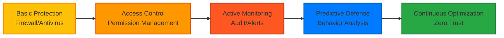

# Business Benefits of Data Governance

Implementing effective data governance is not just a technical project, but a strategic investment that brings tangible business value to enterprises. This page details the six core benefits data governance brings to enterprises.

## Overview of Core Benefits

  <FeatureCard 
    icon="📊"
    title="Improve Decision Quality & Efficiency" 
    description="Make faster and more accurate business decisions based on high-quality data."
  />
  <FeatureCard 
    icon="⚖️"
    title="Reduce Compliance Risks" 
    description="Meet legal and regulatory requirements, avoid high fines and reputational losses."
  />
  <FeatureCard 
    icon="💰"
    title="Optimize Resource Allocation" 
    description="Reduce data redundancy and waste, lower storage and management costs."
  />
  <FeatureCard 
    icon="🔒"
    title="Enhance Data Security" 
    description="Protect sensitive data, prevent data leakage and misuse."
  />
  <FeatureCard 
    icon="🚀"
    title="Accelerate Digital Transformation" 
    description="Provide reliable data foundation for AI, big data and other innovative applications."
  />
  <FeatureCard 
    icon="🤝"
    title="Improve Collaboration Efficiency" 
    description="Break down data silos, promote cross-departmental collaboration and data sharing."
  />

## 1. Improve Decision Quality & Efficiency 📊

### Pain Points

Many enterprises face the following dilemmas when making decisions:

-   Data is not trustworthy, dare not make data-based decisions
-   Data scattered across various systems, difficult to integrate for analysis
-   Finding and understanding data takes a lot of time
-   Different reports show inconsistent data, unable to reach consensus

### Role of Data Governance

Through implementing data governance:

✅ **Provide Trustworthy Data**

-   Establish data quality standards to ensure data accuracy and reliability
-   Implement data quality monitoring to detect and correct issues promptly
-   Clarify authoritative data sources to avoid "multiple versions of truth"

✅ **Accelerate Data Access**

-   Quickly find needed data through data catalog
-   Metadata management makes data meaning clear
-   Standardized data access processes

✅ **Support In-Depth Analysis**

-   Connect data from different sources to support comprehensive analysis
-   Establish data lineage to understand data provenance
-   Provide high-quality training data for AI and machine learning

### Actual Effectiveness

::: tip Data Speaks
According to Forrester research, enterprises implementing data governance:

-   **Decision speed increased 5x**: From weeks to days
-   **Decision accuracy increased 40%**: Avoid wrong decisions based on trustworthy data
-   **Data analyst efficiency increased 60%**: Reduce time spent finding and cleaning data
    :::

### Application Scenarios

**Financial Industry: Risk Decisions**

-   Integrate customer transaction, credit, and behavioral data
-   Real-time risk assessment, rapid approval
-   Early identification of fraudulent behavior

**Retail Industry: Precision Marketing**

-   Unified 360-degree customer view
-   Customer segmentation based on complete data
-   Personalized recommendations to improve conversion rates

**Manufacturing Industry: Supply Chain Optimization**

-   Integrate procurement, production, inventory, and logistics data
-   Real-time monitoring of supply chain status
-   Optimize inventory levels, reduce stockout risks

## 2. Reduce Compliance Risks ⚖️

### Increasingly Strict Regulatory Environment

Globally, data protection regulations are becoming increasingly strict:

| Regulation                             | Region           | Maximum Fine                | Key Requirements                                       |
| -------------------------------------- | ---------------- | --------------------------- | ------------------------------------------------------ |
| **GDPR**                               | EU               | €20M or 4% global revenue   | Informed consent, data minimization, right to deletion |
| **CCPA**                               | California       | $7,500/violation            | Data transparency, opt-out, right to deletion          |
| **Cybersecurity Level Protection 2.0** | China            | Penalties by level          | Data classification, access control, audit             |
| **HIPAA**                              | US (Healthcare)  | $1.5M/year                  | Patient privacy protection, data encryption            |
| **PCI DSS**                            | Global (Payment) | Revocation of qualification | Payment card data protection                           |

### Cost of Non-Compliance

**Financial Loss:**

-   High fines: Highest GDPR fine reached €746M (Amazon)
-   Litigation costs: High cost of data breach lawsuits
-   Business interruption: Regulators may require cessation of data processing

**Reputational Loss:**

-   Decreased customer trust
-   Damaged brand image
-   Stock price decline

**Real Case:**

> In 2021, an airline was fined £20M by the UK ICO for a data breach incident. Subsequently, its stock price fell 8% and customer churn rate increased 15%.

### How Data Governance Helps Compliance

✅ **Data Discovery and Classification**

-   Identify the location of all sensitive data
-   Classify management by sensitivity level
-   Establish data asset inventory

✅ **Access Control and Auditing**

-   Role-based permission management
-   Record all data access and operations
-   Support compliance auditing and forensics

✅ **Data Protection Measures**

-   Data encryption (transmission and storage)
-   Data masking and anonymization
-   Secure data destruction

✅ **Processes and Policies**

-   Establish data protection policies
-   Implement Privacy Impact Assessment (PIA)
-   Data subject rights response process (e.g., deletion requests)

✅ **Continuous Monitoring**

-   Real-time monitoring of compliance status
-   Automated compliance checking
-   Timely detection and correction of violations

::: warning Important Note
Compliance is not a one-time project but a continuous process. The data governance framework ensures that enterprises can continuously meet compliance requirements.
:::

## 3. Optimize Resource Allocation 💰

### Hidden Costs of Data Management

Enterprises often underestimate the costs of data management:

**Storage Costs:**

-   Duplicate storage of same data
-   Retention of large amounts of useless historical data
-   Inefficient storage architecture

**Labor Costs:**

-   Data analysts spend 60-80% of time on data preparation
-   IT teams handling data quality issues
-   Business personnel reworking due to data errors

**Opportunity Costs:**

-   Data silos lead to inability to fully utilize data
-   Data quality issues lead to missed business opportunities
-   Lack of data support hinders innovation

### Savings from Data Governance

✅ **Reduce Storage Costs (20-30%)**

-   Eliminate duplicate data
-   Implement data lifecycle management, timely archiving and destruction
-   Data compression and deduplication

✅ **Improve Personnel Efficiency (50-60%)**

-   Data catalog makes finding data faster
-   High-quality data reduces cleaning time
-   Automated data quality checking

✅ **Reduce System Integration Costs (40%)**

-   Unified data standards reduce conversion complexity
-   Master data management avoids duplicate integration
-   Clear data lineage simplifies impact analysis

✅ **Increase Data Reuse Rate**

-   Data assets can be reused in multiple business scenarios
-   Avoid duplicate development of same data processing logic

### ROI Case

**Case: A Retail Enterprise**

Comparison before and after implementing data governance:

| Metric                      | Before Governance     | After Governance     | Improvement         |
| --------------------------- | --------------------- | -------------------- | ------------------- |
| Data storage cost           | $5M/year              | $3.5M/year           | **Saved 30%**       |
| Data analyst data prep time | 70%                   | 30%                  | **2.3x efficiency** |
| Rework due to data quality  | 200 person-days/month | 50 person-days/month | **Reduced 75%**     |
| Data duplication rate       | 35%                   | 8%                   | **Reduced 27%**     |

**Return on Investment:**

-   Data governance investment: $2M
-   Annual savings: $2.8M
-   ROI: **140%** (Cost recovered in first year)

## 4. Enhance Data Security 🔒

### Data Security Threats

Enterprises face increasing data security threats:

-   **External Attacks**: Hacker intrusions, ransomware
-   **Internal Leaks**: Employees intentionally or unintentionally leaking data
-   **Vendor Risks**: Third-party vendors improperly handling data
-   **Technical Vulnerabilities**: System vulnerabilities being exploited

**Cost of Data Breaches:**

> IBM's "2024 Cost of a Data Breach Report" shows that the global average cost of a data breach is **$4.45 million**, including:
>
> -   Detection and response costs
> -   Notification and regulatory costs
> -   Business losses
> -   Reputational damage

### Security Measures in Data Governance

✅ **Data Classification and Labeling**

-   Identify sensitive data (PII, financial, trade secrets)
-   Classify management by sensitivity level
-   Automatically label and track sensitive data

✅ **Fine-Grained Access Control**

-   Principle of least privilege
-   Role-Based Access Control (RBAC)
-   Attribute-Based Access Control (ABAC)
-   Regular permission reviews

✅ **Data Encryption and Masking**

-   Transmission encryption (TLS/SSL)
-   Storage encryption (AES-256)
-   Sensitive data masking in production environment
-   Data anonymization in testing environment

✅ **Comprehensive Audit Trail**

-   Record all data access and modifications
-   Real-time alerts for abnormal behavior
-   Support post-incident tracing and forensics

✅ **Data Loss Prevention (DLP)**

-   Monitor data outflow
-   Block unauthorized data transmission
-   Approval for sensitive data export

### Security Maturity Improvement

Data governance helps enterprises transition from passive defense to active management:

## 5. Accelerate Digital Transformation 🚀

### Data is the Foundation of Digital Transformation

All digital transformation initiatives cannot do without high-quality data:

-   **Artificial Intelligence/Machine Learning**: Requires large amounts of high-quality training data
-   **Internet of Things (IoT)**: Requires integration and analysis of massive sensor data
-   **Cloud Migration**: Requires data cleaning and standardization
-   **Digital Customer Experience**: Requires unified customer data view
-   **Data-Driven Culture**: Requires trustworthy data and self-service analytics capabilities

### How Data Governance Enables Innovation

✅ **Provide Reliable Data for AI/ML**

-   High-quality training data improves model accuracy
-   Data lineage ensures model interpretability
-   Metadata management supports feature engineering

✅ **Support Data Productization**

-   Provide data as products internally and externally
-   Data APIs and data marketplaces
-   Data monetization

✅ **Empower Citizen Data Scientists**

-   Self-service analytics platforms
-   Data catalog helps business users find data
-   Data literacy training

✅ **Rapid Experimentation and Iteration**

-   Standardized data reduces integration time
-   High-quality data reduces debugging time
-   Data sandbox supports safe experimentation

### Innovation Cases

**Case 1: AI-Driven Intelligent Customer Service**

-   Train NLP models based on unified customer data
-   Accurately identify customer intent, automatically answer 90% of common questions
-   Customer satisfaction increased 25%, labor costs reduced 60%

**Case 2: Predictive Maintenance**

-   Integrate equipment sensors, maintenance history, environmental data
-   Predict equipment failures, schedule maintenance in advance
-   Equipment downtime reduced 40%, maintenance costs reduced 30%

**Case 3: Personalized Recommendations**

-   Unified user behavior, preferences, transaction data
-   Real-time recommendation engine
-   Conversion rate increased 35%, average order value increased 20%

## 6. Improve Collaboration Efficiency 🤝

### Harm of Data Silos

In enterprises lacking data governance, common scenarios:

-   Sales and marketing departments have different customer lists
-   Financial data and business data don't match
-   Each department building its own data warehouse
-   Cross-departmental collaboration requires extensive data reconciliation work

### Data Governance Promotes Collaboration

✅ **Unified Data Language**

-   Establish enterprise-level data dictionary
-   Unified business terminology and metric definitions
-   Eliminate "talking past each other"

✅ **Break Down Data Silos**

-   Master data management provides single source of truth
-   Data sharing platform
-   Cross-system data integration

✅ **Clarify Data Responsibilities**

-   Clear data ownership
-   Data stewards responsible for data quality
-   Data consumers comply with rules

✅ **Self-Service Data Access**

-   Data catalog: self-service data discovery
-   Standardized APIs: convenient data access
-   Approval process: secure and orderly access

### Collaboration Benefits

**Metric Improvements:**

-   Cross-departmental project startup time reduced 50%
-   Data-related meeting time reduced 40%
-   Data issue tickets reduced 70%
-   Employee data satisfaction increased 60%

**Cultural Transformation:**

-   From "my data" to "our data"
-   From data hoarding to data sharing
-   From data fragmentation to data collaboration

## Summary: Comprehensive Value of Data Governance

Data governance is not a single-dimensional improvement, but a comprehensive enhancement of enterprise capabilities:

| Dimension            | Direct Benefits                                      | Indirect Benefits                                |
| -------------------- | ---------------------------------------------------- | ------------------------------------------------ |
| **Business Value**   | Decision accuracy ↑40%, revenue ↑15-20%              | Customer satisfaction ↑, market responsiveness ↑ |
| **Risk Value**       | Compliance fines avoided, data breaches ↓60%         | Brand reputation protection, customer trust ↑    |
| **Cost Value**       | IT costs ↓20-30%, labor efficiency ↑50%              | Lower opportunity costs                          |
| **Innovation Value** | AI/big data project success rate ↑, time to market ↓ | Accelerated digital transformation               |

::: tip Key Insight
The return on investment period for data governance is typically **12-18 months**, after which it will continue to generate value. Early investment, long-term benefits.
:::

## Next Steps

-   🚀 [Check the implementation guide to start your data governance journey](/en/implementation)
-   💼 [Learn from success stories and best practices](/en/cases/)
-   💬 [Contact us for personalized advice](/en/contact)

---

"Data governance is not a cost, but an investment. The value it creates for enterprises far exceeds the initial investment."

