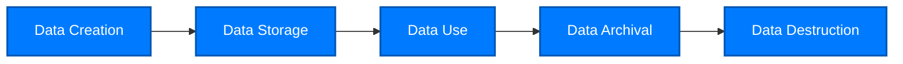

# Data Governance Overview

## What is Data Governance?

**Data Governance** refers to a series of policies, processes, standards, and organizational structures established by an organization to ensure effective management and use of data assets. It is a comprehensive management framework aimed at improving data quality, security, availability, and compliance.

::: tip Definition
Data governance is a collection of activities that exercise power and control over data asset management, including planning, supervision, and execution.
:::

Simply put, data governance answers the following core questions:

-   **Who** has the right to access and modify data?
-   **What** data needs to be managed?
-   **When** should data quality checks be performed?
-   **Where** is data stored and processed?
-   **Why** are these data rules established?
-   **How** to ensure data rules are followed?

## Why Do We Need Data Governance?

### Current Data Challenges Enterprises Face

<div class="feature-cards">
  <FeatureCard 
    icon="🔍"
    title="Low Data Quality" 
    description="Inaccurate, incomplete, and inconsistent data leads to business decision errors and operational inefficiency."
  />
  <FeatureCard 
    icon="🏝️"
    title="Data Silos" 
    description="Data from different departments and systems is isolated, difficult to share and integrate, causing redundant construction and resource waste."
  />
  <FeatureCard 
    icon="⚠️"
    title="Compliance Risks" 
    description="Unable to meet GDPR, CCPA and other data protection regulations, facing high fines and legal disputes."
  />
  <FeatureCard 
    icon="🔓"
    title="Security Threats" 
    description="Lack of unified data security management, high risk of sensitive data leakage."
  />
  <FeatureCard 
    icon="💸"
    title="Cost Waste" 
    description="Duplicate storage, accumulation of invalid data, high data management costs."
  />
  <FeatureCard 
    icon="🎲"
    title="Decision Difficulties" 
    description="Uncertain which data is trustworthy, difficult to make quick and accurate decisions based on data."
  />
</div>

### Value Brought by Data Governance

Through implementing effective data governance, enterprises can achieve:

-   ✅ **Improved Data Quality**: Establish data standards and quality rules to ensure data accuracy and reliability
-   ✅ **Reduced Compliance Risks**: Meet legal and regulatory requirements, avoid fines and lawsuits
-   ✅ **Enhanced Data Security**: Protect sensitive data and prevent data leakage
-   ✅ **Improved Operational Efficiency**: Reduce rework and delays caused by data issues
-   ✅ **Support Business Innovation**: Provide reliable data foundation for AI, big data and other innovative applications
-   ✅ **Optimized Resource Allocation**: Eliminate data redundancy, reduce storage and management costs

## Core Principles of Data Governance

### 1. Data Quality Management <Badge text="Core" type="tip" />

Ensure data **accuracy**, **completeness**, **consistency**, **timeliness**, and **validity**.

**Key Practices:**

-   Establish data quality standards and metrics
-   Implement data quality monitoring and reporting mechanisms
-   Set up data quality issue handling processes
-   Continuously improve data quality

**Example:** Customer phone numbers must conform to specific formats, email addresses must be validated, address information must be complete.

### 2. Metadata Management

Metadata is "data about data," describing the source, meaning, structure, and relationships of data.

**Metadata Types:**

-   **Business Metadata**: Business meaning, business rules, data owners
-   **Technical Metadata**: Data structure, data types, storage location, table relationships
-   **Operational Metadata**: Data access logs, data processing history, data lineage

**Value:**

-   Improve data discoverability: Quickly find needed data
-   Enhance data understandability: Clarify data meaning and usage
-   Support impact analysis: Understand the impact scope of data changes

### 3. Data Security and Privacy

Protect data from unauthorized access, use, disclosure, modification, or destruction.

**Security Measures:**

-   **Access Control**: Role-Based Access Control (RBAC)
-   **Data Encryption**: Transmission encryption and storage encryption
-   **Data Masking**: Mask sensitive data
-   **Audit Logs**: Record all data access and modification operations
-   **Data Classification**: Classify data by sensitivity level

::: warning Important
Processing of Personal Identifiable Information (PII) must comply with GDPR, CCPA and other regulations, including informed consent, data minimization, right to deletion, etc.
:::

### 4. Master Data Management (MDM)

Master data is authoritative data for core business entities such as customers, products, suppliers, and employees.

**Objectives:**

-   Establish unique, accurate, and consistent master data
-   Share master data across the enterprise
-   Eliminate data duplication and inconsistency

**Key Functions:**

-   Data consolidation: Integrate data from multiple sources
-   Data matching: Identify duplicate records
-   Data merging: Generate Golden Records
-   Data distribution: Distribute master data to downstream systems

### 5. Data Lifecycle Management

Manage the entire lifecycle of data from creation, use, archival to destruction.



**Key Considerations:**

-   **Retention Period**: Determine data retention time based on business needs and regulatory requirements
-   **Archival Strategy**: Migrate infrequently used data to low-cost storage
-   **Secure Destruction**: Ensure data cannot be recovered

### 6. Data Standardization

Establish unified data definitions, formats, coding, and naming conventions.

**Standardization Content:**

-   Data naming conventions (e.g., customer_id, CustomerID)
-   Data format conventions (e.g., date format YYYY-MM-DD)
-   Codes and enumeration values (e.g., gender M/F, status codes)
-   Calculation rules (e.g., revenue calculation methods)

**Benefits:**

-   Improve data consistency and comparability
-   Reduce complexity of data integration
-   Facilitate cross-departmental collaboration

## Data Governance Framework

A complete data governance framework typically includes the following elements:

### Organizational Structure

```
Data Governance Committee (Decision Layer)
    ├── Data Governance Office (Execution Layer)
    ├── Data Owners (Business Departments)
    ├── Data Stewards (Technical Team)
    └── Data Consumers (All Employees)
```

**Roles and Responsibilities:**

| Role                          | Responsibilities                                                                          |
| ----------------------------- | ----------------------------------------------------------------------------------------- |
| **Data Governance Committee** | Formulate data strategy, approve major decisions, resolve conflicts                       |
| **Data Governance Office**    | Coordinate execution, develop standards, supervise implementation, training and promotion |
| **Data Owners**               | Responsible for quality, security and use of specific data domains                        |
| **Data Stewards**             | Execute technical implementation, data modeling, quality monitoring                       |
| **Data Consumers**            | Comply with data policies, report data issues                                             |

### Policies and Processes

-   **Data Policies**: Data use principles, security requirements, compliance regulations
-   **Data Standards**: Data definitions, format specifications, quality standards
-   **Operational Processes**: Data requests, data changes, issue handling, audit checks

### Technology Tools

-   **Data Catalog**: Centrally manage metadata and data assets
-   **Data Quality Tools**: Data quality checking, monitoring, and reporting
-   **Master Data Management Platform**: Master data integration and distribution
-   **Data Security Tools**: Access control, encryption, masking, auditing
-   **Data Lineage Tools**: Track data flow and transformation

### Metrics

Establish KPIs to measure data governance effectiveness:

-   **Data Quality Metrics**: Accuracy rate, completeness rate, timeliness rate
-   **Compliance Metrics**: Policy compliance rate, audit findings count
-   **Usage Metrics**: Data access volume, data reuse rate
-   **Value Metrics**: Cost savings, efficiency improvements, risk reduction

## Data Governance vs Data Management

Many people confuse data governance and data management. The difference is:

| Dimension   | Data Governance                              | Data Management                                       |
| ----------- | -------------------------------------------- | ----------------------------------------------------- |
| **Focus**   | "What to do" and "Who is responsible"        | "How to do it"                                        |
| **Level**   | Strategic and management level               | Operational and technical level                       |
| **Content** | Policies, standards, organization, processes | Specific data operations and technical implementation |
| **Roles**   | Joint participation of business and IT       | Mainly IT and data teams                              |

**Simple Understanding:** Data governance sets rules, data management executes rules.

## Industry Best Practices

### DAMA-DMBOK Framework

DAMA (Data Management Association)'s DMBOK (Data Management Body of Knowledge) is the authoritative framework in data management, covering 11 knowledge areas:

1. Data Governance
2. Data Architecture
3. Data Modeling & Design
4. Data Storage & Operations
5. Data Security
6. Data Integration & Interoperability
7. Documents & Content Management
8. Reference & Master Data
9. Data Warehousing & Business Intelligence
10. Metadata Management
11. Data Quality

### COBIT Framework

COBIT (Control Objectives for Information and Related Technologies) provides IT governance best practices, including data governance content.

### Regulatory Requirements

Different industries and regions have different data governance-related regulations:

-   **GDPR** (EU General Data Protection Regulation): Protect personal data of EU citizens
-   **CCPA** (California Consumer Privacy Act): Protect privacy rights of California residents
-   **Cybersecurity Level Protection 2.0** (China): Domestic data security standards
-   **HIPAA** (US Health Insurance Portability and Accountability Act): Protect patient health information
-   **SOX Act** (Sarbanes-Oxley Act): Financial data governance requirements

## Next Steps

Now that you understand the basic concepts and core principles of data governance, you can:

-   📊 [Learn about the business benefits of data governance](/en/what-is-data-governance/benefits)
-   🚀 [Check the implementation guide to start data governance](/en/implementation)

---

::: info Related Resources

-   [DAMA International](https://www.dama.org/)
-   [Data Governance Institute](http://www.datagovernance.com/)
-   [Gartner Data Governance Research](https://www.gartner.com/)
    :::
