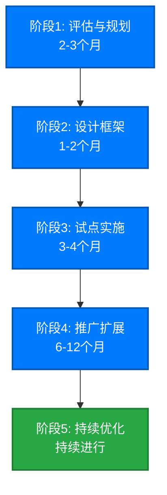
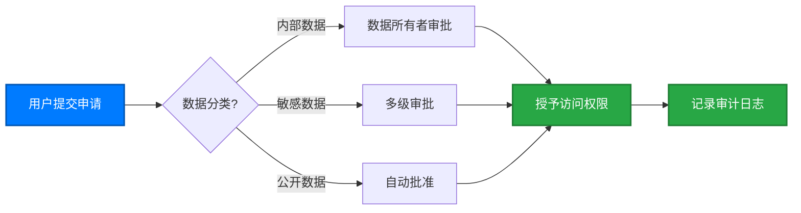
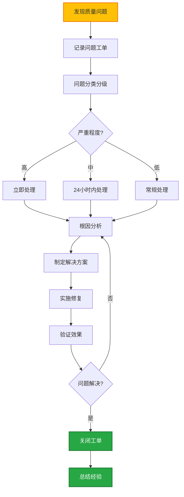
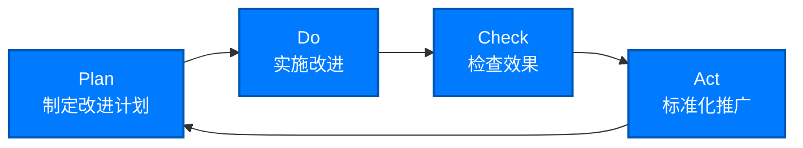

# 数据治理实施指南

成功实施数据治理需要系统化的方法和分阶段的推进策略。本指南提供可操作的步骤和最佳实践,帮助您的企业建立有效的数据治理体系。

::: tip 核心原则
数据治理是一个持续的旅程,不是一次性项目。建议采用**渐进式**和**迭代式**的实施方法,从小范围试点开始,逐步扩展。
:::

## 实施路线图



## 阶段 1:评估与规划（2-3 个月）

### 1.1 现状评估

全面评估企业当前的数据管理状况。

#### 评估维度

**数据资产盘点:**

-   有哪些数据源和系统?
-   数据量级和增长趋势?
-   关键业务数据有哪些?
-   敏感数据的分布?

**数据质量评估:**

-   当前数据质量问题有哪些?
-   数据质量问题对业务的影响?
-   数据质量问题的根因?

**组织与流程:**

-   是否有数据相关的角色和职责?
-   是否有数据管理的政策和流程?
-   数据相关的决策如何做出?

**技术能力:**

-   现有的数据管理工具?
-   IT 基础设施成熟度?
-   技术团队的数据管理能力?

**合规状况:**

-   需要遵守哪些法律法规?
-   当前合规差距?
-   潜在合规风险?

#### 评估方法

<div class="feature-cards">
  <FeatureCard 
    icon="📋"
    title="问卷调查" 
    description="向业务部门和IT部门发放调查问卷,收集对数据问题的反馈。"
  />
  <FeatureCard 
    icon="💬"
    title="访谈座谈" 
    description="与关键干系人深度访谈,了解痛点和期望。"
  />
  <FeatureCard 
    icon="🔍"
    title="技术扫描" 
    description="使用工具扫描数据资产,发现数据质量和安全问题。"
  />
  <FeatureCard 
    icon="📊"
    title="成熟度评估" 
    description="参照DAMA、CMMI等框架评估数据管理成熟度。"
  />
</div>

#### 评估输出

-   **数据资产清单**:所有数据源和关键数据实体
-   **问题列表**:按优先级排序的数据问题
-   **差距分析报告**:现状 vs 目标的差距
-   **成熟度评分**:各维度的成熟度得分

### 1.2 战略规划

基于评估结果,制定数据治理战略。

#### 明确目标

设定 SMART 目标（具体、可衡量、可实现、相关性、时限性）:

**示例目标:**

-   ✅ 12 个月内,核心业务数据质量准确率达到 98%以上
-   ✅ 6 个月内,100%敏感数据实施访问控制和加密
-   ✅ 建立企业级数据目录,覆盖 80%关键数据资产
-   ✅ 实现 GDPR 合规,通过外部审计

#### 确定范围

**建议从小范围开始:**

-   选择 1-2 个业务域进行试点（如客户数据、产品数据）
-   聚焦最痛的数据质量问题
-   选择影响大、复杂度适中的场景

#### 获取支持

数据治理需要高层支持和跨部门协作:

-   向高层管理层汇报,获得资源支持
-   识别执行赞助人（Executive Sponsor）
-   组建跨部门的推进团队
-   制定沟通计划,管理变革

#### 预算规划

典型数据治理项目的成本构成:

| 成本项       | 占比   | 说明                           |
| ------------ | ------ | ------------------------------ |
| **人力成本** | 40-50% | 项目团队、咨询服务、培训       |
| **工具平台** | 30-40% | 数据目录、数据质量、MDM 等工具 |
| **基础设施** | 10-15% | 服务器、存储、网络             |
| **其他**     | 5-10%  | 差旅、办公、外部审计           |

::: warning 预算建议

-   中小企业:$50 万 - $150 万
-   大型企业:$200 万 - $500 万+
-   记得预留 20%的应急预算
    :::

### 1.3 制定路线图

将目标分解为可执行的里程碑和任务。

**典型 18 个月路线图:**

| 时间    | 阶段     | 主要任务                     | 成果       |
| ------- | -------- | ---------------------------- | ---------- |
| M1-M3   | 评估规划 | 现状评估、战略制定           | 实施路线图 |
| M4-M5   | 框架设计 | 组织架构、政策流程、技术架构 | 治理框架   |
| M6-M9   | 试点实施 | 工具部署、数据域试点         | 试点成功   |
| M10-M15 | 推广扩展 | 全面推广、培训赋能           | 全面覆盖   |
| M16-M18 | 优化提升 | 流程优化、能力提升           | 持续改进   |

## 阶段 2:设计框架（1-2 个月）

### 2.1 组织架构设计

建立清晰的数据治理组织架构和角色职责。

#### 典型组织架构

```
数据治理委员会（Steering Committee）
    |
数据治理办公室（Data Governance Office）
    |
    ├── 数据所有者（Data Owners）
    |     └── 业务部门负责人
    |
    ├── 数据管理员（Data Stewards）
    |     ├── 业务数据管理员
    |     └── 技术数据管理员
    |
    └── 数据使用者（Data Consumers）
          └── 所有员工
```

#### 角色与职责（RACI 矩阵）

| 活动         | 治理委员会 | 治理办公室 | 数据所有者 | 数据管理员 | IT 团队 |
| ------------ | ---------- | ---------- | ---------- | ---------- | ------- |
| 数据战略制定 | **A**      | R          | C          | C          | I       |
| 数据政策批准 | **A**      | R          | C          | I          | I       |
| 数据标准制定 | C          | **A**      | R          | R          | C       |
| 数据质量监控 | I          | C          | **A**      | R          | R       |
| 工具技术实施 | I          | C          | C          | C          | **R/A** |
| 问题处理     | I          | C          | **A**      | R          | R       |

**说明:** R=执行者, A=负责人, C=咨询者, I=知情者

#### 人员配置

**治理办公室核心团队（5-8 人）:**

-   数据治理总监 × 1
-   业务数据管理员 × 2-3
-   技术数据管理员 × 2-3
-   项目经理 × 1

### 2.2 政策与标准制定

建立数据治理的"宪法"和"法律"。

#### 核心政策文档

**1. 数据治理政策（Data Governance Policy）**

-   数据治理愿景和原则
-   组织架构和角色职责
-   决策机制和升级路径

**2. 数据管理政策（Data Management Policy）**

-   数据生命周期管理
-   数据质量管理
-   数据安全与隐私
-   元数据管理

**3. 数据使用政策（Data Usage Policy）**

-   数据访问申请流程
-   数据使用规范
-   禁止行为（如私自下载敏感数据）

**4. 数据安全政策（Data Security Policy）**

-   数据分类分级标准
-   访问控制规则
-   加密和脱敏要求
-   审计和监控

#### 数据标准

**命名规范:**

```
# 表命名
<业务域>_<实体>_<类型>
示例:crm_customer_master

# 字段命名
<实体>_<属性>_<修饰符>
示例:customer_id, customer_name, customer_create_date
```

**数据类型标准:**

-   日期时间:ISO 8601 格式（YYYY-MM-DD HH:MM:SS）
-   货币:统一货币代码（如 CNY、USD）
-   国家/地区:ISO 3166-1 代码（如 CN、US）
-   电话号码:E.164 格式

**数据质量规则:**

-   必填字段列表
-   唯一性约束
-   值域范围
-   格式要求
-   逻辑一致性

### 2.3 流程设计

建立标准化的数据管理流程。

#### 核心流程

**1. 数据访问申请流程**



**2. 数据质量问题处理流程**



**3. 新数据源接入流程**

-   业务需求评审
-   数据源评估（质量、安全、合规）
-   技术方案设计
-   开发测试
-   上线验收
-   元数据注册

**4. 数据变更管理流程**

-   变更申请
-   影响分析（基于数据血缘）
-   变更审批
-   变更实施
-   变更通知

### 2.4 技术架构设计

规划数据治理的技术支撑平台。

#### 技术组件

<div class="feature-cards">
  <FeatureCard 
    icon="📚"
    title="数据目录" 
    description="元数据管理、数据资产搜索、数据血缘可视化。推荐工具:Collibra、Alation、Apache Atlas。"
  />
  <FeatureCard 
    icon="✅"
    title="数据质量" 
    description="质量规则配置、质量监控、质量报告。推荐工具:Informatica DQ、Talend DQ、Great Expectations。"
  />
  <FeatureCard 
    icon="👑"
    title="主数据管理" 
    description="主数据整合、匹配、合并。推荐工具:Informatica MDM、SAP MDG、Microsoft MDS。"
  />
  <FeatureCard 
    icon="🔐"
    title="数据安全" 
    description="访问控制、数据加密、脱敏、审计。推荐工具:Apache Ranger、Privacera、Immuta。"
  />
  <FeatureCard 
    icon="📊"
    title="数据血缘" 
    description="自动化血缘解析、影响分析。推荐工具:Manta、Octopai、集成在数据目录中。"
  />
  <FeatureCard 
    icon="📋"
    title="工作流引擎" 
    description="数据治理流程自动化。推荐工具:Camunda、Activiti、或内置工作流。"
  />
</div>

#### 参考架构

```
┌─────────────────────────────────────────────────────┐
│                  用户界面层                            │
│  数据目录 | 数据质量监控 | 工作流门户 | 分析报表      │
└─────────────────────────────────────────────────────┘
                        ↓
┌─────────────────────────────────────────────────────┐
│                 数据治理服务层                          │
│  元数据管理 | 质量管理 | 安全管理 | 血缘管理 | 流程引擎│
└─────────────────────────────────────────────────────┘
                        ↓
┌─────────────────────────────────────────────────────┐
│                  数据存储层                            │
│  元数据库 | 质量库 | 主数据库 | 审计日志               │
└─────────────────────────────────────────────────────┘
                        ↓
┌─────────────────────────────────────────────────────┐
│                  数据源层                              │
│  数据库 | 数据仓库 | 数据湖 | 业务系统 | 文件系统      │
└─────────────────────────────────────────────────────┘
```

#### 技术选型建议

**开源 vs 商业:**

| 方案     | 优点                       | 缺点                   | 适用场景             |
| -------- | -------------------------- | ---------------------- | -------------------- |
| **开源** | 成本低、灵活性高、社区支持 | 需要技术能力、集成复杂 | 技术实力强、预算有限 |
| **商业** | 功能完善、支持好、快速上线 | 成本高、厂商锁定       | 快速见效、预算充足   |
| **混合** | 平衡成本和功能             | 架构复杂度高           | 大部分企业           |

**推荐组合:**

-   初创/中小企业:开源为主（Apache Atlas + Great Expectations + Apache Ranger）
-   大型企业:商业为主（Collibra + Informatica DQ + Informatica MDM）
-   务实方案:混合使用（商业数据目录 + 开源数据质量）

## 阶段 3:试点实施（3-4 个月）

### 3.1 试点范围选择

选择合适的试点场景至关重要。

#### 选择标准

好的试点应该:

-   ✅ **业务价值高**:解决实际痛点,有明显收益
-   ✅ **复杂度适中**:不要太简单（没有代表性）,也不要太复杂（风险高）
-   ✅ **干系人支持**:业务部门愿意配合
-   ✅ **可扩展性好**:成功经验可以复用到其他场景

#### 典型试点场景

**场景 1:客户主数据管理**

-   痛点:多个系统有重复的客户数据,不一致
-   目标:建立统一的客户 360 度视图
-   范围:整合 CRM、ERP、电商系统的客户数据
-   周期:3 个月
-   价值:提升客户服务质量、支持精准营销

**场景 2:财务数据质量提升**

-   痛点:财务报表准备耗时长,数据准确性问题
-   目标:财务数据质量达到 98%以上
-   范围:核心财务指标的数据质量规则和监控
-   周期:2 个月
-   价值:缩短月结时间、满足审计要求

**场景 3:GDPR 合规**

-   痛点:不清楚个人数据在哪里,难以响应删除请求
-   目标:识别所有个人数据,实施访问控制
-   范围:盘点 PII 数据、实施数据分类和权限管理
-   周期:4 个月
-   价值:满足 GDPR 合规、避免罚款

### 3.2 工具部署

分阶段部署数据治理工具。

#### 部署步骤

**1. 环境准备（1-2 周）**

-   服务器、存储、网络配置
-   数据库安装
-   安全配置

**2. 工具安装（1-2 周）**

-   软件安装和配置
-   集成认证系统（AD/LDAP）
-   基础功能测试

**3. 数据接入（2-3 周）**

-   连接数据源
-   元数据采集
-   数据血缘解析

**4. 规则配置（2-3 周）**

-   配置数据质量规则
-   配置访问控制策略
-   配置工作流

**5. 用户培训（1 周）**

-   管理员培训
-   最终用户培训
-   文档和视频教程

### 3.3 试点执行

按计划执行试点项目。

#### 执行要点

**建立项目管理机制:**

-   每周项目例会,跟踪进度
-   风险和问题管理
-   变更控制

**数据质量提升:**

-   数据 profiling,发现质量问题
-   根因分析,制定改进措施
-   数据清洗和修复
-   持续监控

**用户赋能:**

-   手把手培训关键用户
-   建立帮助文档和 FAQ
-   设立支持热线

**效果度量:**

-   设定基线和目标 KPI
-   定期测量和报告进度
-   收集用户反馈

### 3.4 试点总结

试点结束后,全面总结经验教训。

#### 评估维度

-   ✅ 目标达成情况（KPI 完成度）
-   ✅ 用户满意度
-   ✅ 业务价值实现
-   ✅ 技术方案可行性
-   ✅ 流程有效性

#### 输出

-   **试点总结报告**:成果、问题、建议
-   **最佳实践文档**:可复用的经验
-   **推广计划**:下一步行动

::: tip 成功标准
试点成功的标志:

-   达成 80%以上的目标 KPI
-   用户满意度 ≥4 分（5 分制）
-   业务部门愿意继续推广
-   管理层认可价值
    :::

## 阶段 4:推广扩展（6-12 个月）

### 4.1 推广策略

从试点到全面推广需要有序的策略。

#### 推广路径

**方式 1:按业务域推广**

-   客户域 → 产品域 → 供应链域 → 财务域 → ...
-   每个业务域独立实施,周期 2-3 个月

**方式 2:按能力推广**

-   数据目录 → 数据质量 → 主数据管理 → 数据安全 → ...
-   逐步增加治理能力

**方式 3:混合推广**

-   横向:覆盖更多业务域
-   纵向:深化治理能力
-   最常见的方式

#### 推广节奏

建议采用"波次推广":

-   **第一波**（M1-M3）:扩展到 2-3 个新业务域
-   **第二波**（M4-M6）:再扩展 3-5 个业务域
-   **第三波**（M7-M9）:全面覆盖所有核心业务域
-   **第四波**（M10-M12）:深化和优化

### 4.2 规模化挑战

推广过程中会遇到新的挑战。

#### 常见挑战及应对

| 挑战           | 应对措施                               |
| -------------- | -------------------------------------- |
| **变革阻力**   | 高层支持、培训宣传、激励机制、快速见效 |
| **资源不足**   | 优先级管理、外部支持、自动化工具       |
| **复杂度增加** | 简化流程、标准化模板、知识管理         |
| **工具性能**   | 优化配置、横向扩展、分布式架构         |
| **文化融合**   | 持续沟通、榜样示范、融入考核           |

### 4.3 组织赋能

建设企业的数据治理能力。

#### 培训体系

**1. 意识培训（全员）**

-   数据治理是什么、为什么重要
-   每个人的责任
-   时长:1-2 小时

**2. 角色培训（分角色）**

-   数据所有者培训（1 天）
-   数据管理员培训（3 天）
-   最终用户培训（2 小时）

**3. 技术培训（技术人员）**

-   工具使用培训
-   管理员培训
-   开发集成培训

#### 数据文化建设

**价值观塑造:**

-   数据是资产
-   数据质量人人有责
-   数据共享创造价值

**行为引导:**

-   将数据治理纳入绩效考核
-   设立数据质量奖
-   树立标杆和榜样

**持续沟通:**

-   定期分享成功故事
-   数据治理简报
-   内部社区和论坛

## 阶段 5:持续优化（持续进行）

### 5.1 监控与度量

建立持续监控和度量机制。

#### 关键指标体系

**数据质量指标:**

-   数据准确率
-   数据完整率
-   数据及时率
-   数据一致率
-   质量问题数量和解决时间

**运营指标:**

-   数据资产数量
-   数据访问次数
-   工作流处理时间
-   用户满意度

**价值指标:**

-   成本节约
-   效率提升
-   风险降低
-   业务增长

**合规指标:**

-   政策遵守率
-   审计发现数
-   合规培训覆盖率

#### 仪表盘示例

```
数据治理仪表盘
┌─────────────────┬─────────────────┬─────────────────┐
│ 数据质量        │ 合规状态        │ 业务价值        │
│                 │                 │                 │
│ 整体得分: 92/100│ 合规率: 98%    │ 成本节约:       │
│ ■■■■■■■■■□     │ ■■■■■■■■■□     │ $2.5M/年       │
│                 │                 │                 │
│ 问题工单: 15个  │ 审计发现: 3个   │ 效率提升: 45%   │
│ (5个高优先级)   │ (均已修复)      │                 │
└─────────────────┴─────────────────┴─────────────────┘

数据资产统计                    本月活跃度
- 数据源: 85个                  - 活跃用户: 520人
- 数据表: 2,340张               - 数据访问: 12,450次
- 关键指标: 450个               - 问题报告: 28个
```

### 5.2 持续改进

数据治理是一个不断优化的过程。

#### 改进循环（PDCA）



#### 改进来源

-   监控指标异常
-   用户反馈和建议
-   问题根因分析
-   行业最佳实践
-   新技术和工具
-   新的业务需求

#### 定期评审

建立定期评审机制:

| 评审             | 频率   | 参与者                 | 内容               |
| ---------------- | ------ | ---------------------- | ------------------ |
| **日常运营评审** | 每周   | 治理办公室             | 工单处理、问题跟踪 |
| **战术评审**     | 每月   | 数据管理员、数据所有者 | KPI 回顾、流程优化 |
| **战略评审**     | 每季度 | 治理委员会             | 战略调整、重大决策 |
| **年度评审**     | 每年   | 高层管理、全体成员     | 年度总结、下年规划 |

### 5.3 能力进阶

从基础到高级,不断提升数据治理能力。

#### 成熟度模型

```
Level 5: 优化
  │  持续创新、行业领先、数据驱动文化
  │
Level 4: 管理
  │  量化管理、预测分析、主动优化
  │
Level 3: 定义
  │  标准化流程、工具支持、全面覆盖
  │
Level 2: 可重复
  │  基本流程、试点成功、部分覆盖
  │
Level 1: 初始
  │  临时性、混乱、依赖个人
  │
```

**提升路径:**

-   从手工到自动化
-   从被动到主动
-   从局部到全局
-   从管理到赋能


---

## 下一步

-   ⭐ [了解成功要素,避免常见陷阱](/zh/implementation/success-factors)
-   ✅ [使用实施检查清单,确保不遗漏关键步骤](/zh/implementation/checklist)
-   📖 [返回实施指南概述](/zh/implementation/)
