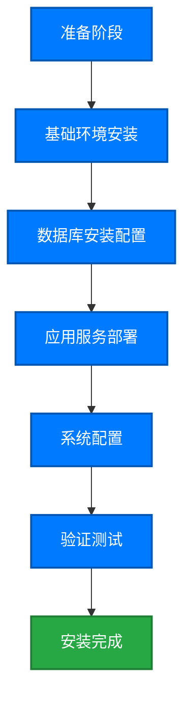

# 数据治理产品安装手册

本手册详细介绍数据治理平台的安装部署流程，帮助您快速、安全地完成产品安装和配置。

::: tip 安装提示
建议在非生产环境中先进行测试安装，验证配置正确后再部署到生产环境。整个安装过程大约需要 2-4 小时。
:::

## 安装概览

数据治理平台采用模块化架构，支持灵活的部署方式。



## 系统要求

### 硬件要求

#### 最小配置（测试环境）

| 组件     | 配置要求   |
| -------- | ---------- |
| **CPU**  | 4 核心     |
| **内存** | 16 GB RAM  |
| **磁盘** | 200 GB SSD |
| **网络** | 100 Mbps   |

#### 推荐配置（生产环境）

| 组件         | 配置要求           |
| ------------ | ------------------ |
| **CPU**      | 16 核心            |
| **内存**     | 64 GB RAM          |
| **磁盘**     | 1 TB SSD (RAID 10) |
| **网络**     | 1 Gbps             |
| **备份存储** | 2 TB (异地备份)    |

#### 高可用配置（企业级）

| 组件             | 节点数      | 单节点配置         |
| ---------------- | ----------- | ------------------ |
| **应用服务器**   | 3+          | 16 核心, 64GB RAM  |
| **数据库服务器** | 3 (主从+备) | 16 核心, 128GB RAM |
| **负载均衡器**   | 2           | 8 核心, 16GB RAM   |
| **缓存服务器**   | 3           | 8 核心, 32GB RAM   |

### 软件要求

#### 操作系统

支持以下操作系统（64 位）：

-   ✅ **Linux**
    -   Red Hat Enterprise Linux 8.x / 9.x
    -   CentOS 8.x / Stream 9
    -   Ubuntu 20.04 LTS / 22.04 LTS
    -   SUSE Linux Enterprise Server 15
-   ✅ **Windows Server**
    -   Windows Server 2019
    -   Windows Server 2022
-   ⚠️ **其他 Unix 系统**（需要额外验证）
    -   Oracle Linux 8.x
    -   Debian 11+

::: tip 推荐
生产环境强烈推荐使用 **Linux 系统**（RHEL 或 Ubuntu LTS），具有更好的稳定性和性能。
:::

#### 数据库

支持以下数据库（用于存储元数据、配置信息）：

| 数据库            | 版本要求    | 推荐场景       |
| ----------------- | ----------- | -------------- |
| **PostgreSQL** ⭐ | 12.x - 15.x | 首选，开源免费 |
| **MySQL**         | 8.0.x       | 兼容性好       |
| **Oracle**        | 12c - 19c   | 大型企业       |
| **SQL Server**    | 2017 - 2022 | Windows 环境   |

#### Java 运行环境

-   **JDK/JRE**: 11.x 或 17.x (LTS 版本)
-   推荐: OpenJDK 17 或 Oracle JDK 17

#### 其他依赖

-   **Python**: 3.8+ (用于数据质量检查脚本)
-   **Node.js**: 16.x+ (用于 Web 界面，可选)
-   **Redis**: 6.x+ (用于缓存和会话管理)
-   **Elasticsearch**: 7.x / 8.x (用于全文检索，可选)

### 网络要求

#### 端口规划

| 服务              | 默认端口                 | 协议      | 说明             |
| ----------------- | ------------------------ | --------- | ---------------- |
| **Web 控制台**    | 8080                     | HTTP      | 可自定义         |
| **HTTPS 控制台**  | 8443                     | HTTPS     | 生产环境必须启用 |
| **API 服务**      | 9090                     | HTTP/REST | 应用集成接口     |
| **数据库**        | 5432 (PG) / 3306 (MySQL) | TCP       | 根据数据库类型   |
| **Redis**         | 6379                     | TCP       | 缓存服务         |
| **Elasticsearch** | 9200                     | HTTP      | 搜索服务（可选） |

#### 防火墙规则

确保以下端口在防火墙中开放：

```bash
# Linux (firewalld)
firewall-cmd --permanent --add-port=8080/tcp
firewall-cmd --permanent --add-port=8443/tcp
firewall-cmd --permanent --add-port=9090/tcp
firewall-cmd --reload

# Linux (iptables)
iptables -A INPUT -p tcp --dport 8080 -j ACCEPT
iptables -A INPUT -p tcp --dport 8443 -j ACCEPT
service iptables save
```

### 浏览器要求

Web 控制台支持以下浏览器（最新两个主版本）：

-   ✅ Google Chrome 100+
-   ✅ Microsoft Edge 100+
-   ✅ Mozilla Firefox 100+
-   ✅ Safari 15+ (macOS)
-   ⚠️ IE 11（有限支持，不推荐）

---

## 阶段 1: 准备工作（30 分钟）

### 1.1 获取安装包

#### 下载安装文件

从官方渠道获取以下文件：

1. **主安装包**: `data-governance-platform-v2.5.0.tar.gz`
2. **许可证文件**: `license.key` (联系销售获取)
3. **安装文档**: `installation-guide.pdf`
4. **示例配置**: `config-samples.zip`

#### 文件校验

验证下载文件的完整性：

```bash
# MD5 校验
md5sum data-governance-platform-v2.5.0.tar.gz
# 应输出: a3b5c2d1e4f567890abcdef123456789

# SHA256 校验（更安全）
sha256sum data-governance-platform-v2.5.0.tar.gz
```

### 1.2 创建系统用户

创建专用的运行用户（不要使用 root）：

```bash
# Linux 系统
sudo useradd -m -s /bin/bash dgadmin
sudo passwd dgadmin

# 设置用户权限
sudo usermod -aG wheel dgadmin  # RHEL/CentOS
# 或
sudo usermod -aG sudo dgadmin   # Ubuntu/Debian
```

### 1.3 准备安装目录

```bash
# 创建目录结构
sudo mkdir -p /opt/data-governance/{app,data,logs,config,backup}

# 设置权限
sudo chown -R dgadmin:dgadmin /opt/data-governance
sudo chmod 755 /opt/data-governance

# 切换到安装用户
su - dgadmin
cd /opt/data-governance
```

### 1.4 上传安装包

将下载的安装包上传到服务器：

```bash
# 使用 scp 上传
scp data-governance-platform-v2.5.0.tar.gz dgadmin@server-ip:/opt/data-governance/

# 或使用 SFTP/FTP 工具（如 WinSCP、FileZilla）
```

### 1.5 解压安装包

```bash
cd /opt/data-governance
tar -xzvf data-governance-platform-v2.5.0.tar.gz
cd data-governance-platform-v2.5.0
ls -la
# 应看到: bin/ config/ lib/ scripts/ docs/ LICENSE
```

---

## 阶段 2: 基础环境安装（45 分钟）

### 2.1 安装 Java JDK

#### Linux (RHEL/CentOS)

```bash
# 安装 OpenJDK 17
sudo yum install java-17-openjdk java-17-openjdk-devel -y

# 验证安装
java -version
javac -version
```

#### Linux (Ubuntu/Debian)

```bash
# 更新包索引
sudo apt update

# 安装 OpenJDK 17
sudo apt install openjdk-17-jdk -y

# 验证安装
java -version
```

#### 配置 JAVA_HOME

```bash
# 查找 Java 安装路径
sudo update-alternatives --config java
# 例如输出: /usr/lib/jvm/java-17-openjdk-amd64

# 编辑环境变量
sudo vi /etc/profile.d/java.sh

# 添加以下内容
export JAVA_HOME=/usr/lib/jvm/java-17-openjdk-amd64
export PATH=$JAVA_HOME/bin:$PATH

# 生效配置
source /etc/profile.d/java.sh

# 验证
echo $JAVA_HOME
```

### 2.2 安装 PostgreSQL 数据库

#### Linux (RHEL/CentOS)

```bash
# 添加 PostgreSQL 官方仓库
sudo yum install -y https://download.postgresql.org/pub/repos/yum/reporpms/EL-8-x86_64/pgdg-redhat-repo-latest.noarch.rpm

# 禁用内置 PostgreSQL 模块
sudo dnf -qy module disable postgresql

# 安装 PostgreSQL 14
sudo yum install -y postgresql14-server postgresql14-contrib

# 初始化数据库
sudo /usr/pgsql-14/bin/postgresql-14-setup initdb

# 启动服务
sudo systemctl enable postgresql-14
sudo systemctl start postgresql-14
sudo systemctl status postgresql-14
```

#### Linux (Ubuntu/Debian)

```bash
# 安装 PostgreSQL
sudo apt install postgresql-14 postgresql-contrib-14 -y

# 检查服务状态
sudo systemctl status postgresql
```

#### 配置 PostgreSQL

```bash
# 切换到 postgres 用户
sudo -i -u postgres

# 进入 PostgreSQL 命令行
psql

-- 修改 postgres 用户密码
ALTER USER postgres PASSWORD 'StrongP@ssw0rd!';

-- 创建数据治理专用数据库
CREATE DATABASE datagovernance ENCODING 'UTF8';

-- 创建专用用户
CREATE USER dguser WITH PASSWORD 'DG_P@ssw0rd123';

-- 授予权限
GRANT ALL PRIVILEGES ON DATABASE datagovernance TO dguser;

-- 退出
\q
exit
```

#### 配置远程访问（如需要）

```bash
# 编辑 postgresql.conf
sudo vi /var/lib/pgsql/14/data/postgresql.conf

# 修改监听地址
listen_addresses = '*'  # 或指定 IP

# 编辑 pg_hba.conf
sudo vi /var/lib/pgsql/14/data/pg_hba.conf

# 添加访问规则（根据实际网络调整）
host    datagovernance    dguser    10.0.0.0/8    md5
host    all               all       127.0.0.1/32  md5

# 重启服务
sudo systemctl restart postgresql-14
```

### 2.3 安装 Redis (可选但推荐)

```bash
# RHEL/CentOS
sudo yum install redis -y

# Ubuntu/Debian
sudo apt install redis-server -y

# 启动服务
sudo systemctl enable redis
sudo systemctl start redis

# 验证
redis-cli ping
# 应返回: PONG
```

#### 配置 Redis

```bash
# 编辑配置文件
sudo vi /etc/redis/redis.conf

# 推荐修改：
# 1. 设置密码
requirepass YourRedisPassword123

# 2. 限制监听地址（生产环境）
bind 127.0.0.1

# 3. 设置最大内存
maxmemory 4gb
maxmemory-policy allkeys-lru

# 重启服务
sudo systemctl restart redis
```

### 2.4 安装 Python 3 (可选)

```bash
# RHEL/CentOS
sudo yum install python3 python3-pip -y

# Ubuntu/Debian
sudo apt install python3 python3-pip -y

# 验证
python3 --version
pip3 --version
```

---

## 阶段 3: 数据库初始化（30 分钟）

### 3.1 导入数据库 Schema

```bash
# 进入安装目录
cd /opt/data-governance/data-governance-platform-v2.5.0/scripts/database

# 查看可用的脚本
ls -l
# 应看到:
# - postgresql_schema.sql
# - postgresql_data.sql
# - mysql_schema.sql (如果使用 MySQL)

# 导入 Schema (PostgreSQL)
psql -h localhost -U dguser -d datagovernance -f postgresql_schema.sql

# 输入密码后，等待导入完成

# 导入初始数据
psql -h localhost -U dguser -d datagovernance -f postgresql_data.sql
```

### 3.2 验证数据库安装

```bash
# 连接数据库
psql -h localhost -U dguser -d datagovernance

-- 查看已创建的表
\dt

-- 应看到类似输出：
--  Schema |       Name        | Type  | Owner
-- --------+-------------------+-------+--------
--  public | dg_users          | table | dguser
--  public | dg_metadata       | table | dguser
--  public | dg_data_quality   | table | dguser
--  public | dg_lineage        | table | dguser
--  ...

-- 检查初始数据
SELECT COUNT(*) FROM dg_users;
-- 应返回至少 1 (admin 用户)

\q
```

### 3.3 数据库性能优化（生产环境）

```bash
# 编辑 postgresql.conf
sudo vi /var/lib/pgsql/14/data/postgresql.conf

# 根据硬件配置调整参数（示例：64GB 内存服务器）
shared_buffers = 16GB
effective_cache_size = 48GB
maintenance_work_mem = 2GB
work_mem = 64MB
max_connections = 200
checkpoint_completion_target = 0.9
wal_buffers = 16MB
random_page_cost = 1.1
effective_io_concurrency = 200

# 重启数据库
sudo systemctl restart postgresql-14
```

---

## 阶段 4: 应用服务部署（60 分钟）

### 4.1 配置应用参数

#### 编辑主配置文件

```bash
cd /opt/data-governance/data-governance-platform-v2.5.0
cp config/application.properties.template config/application.properties
vi config/application.properties
```

#### 关键配置项

```properties
# ===== 服务器配置 =====
server.host=0.0.0.0
server.port=8080
server.https.enabled=true
server.https.port=8443
server.context-path=/dg

# ===== 数据库配置 =====
db.type=postgresql
db.host=localhost
db.port=5432
db.name=datagovernance
db.username=dguser
db.password=DG_P@ssw0rd123
db.pool.max=50
db.pool.min=10

# ===== Redis 配置 =====
redis.enabled=true
redis.host=localhost
redis.port=6379
redis.password=YourRedisPassword123
redis.database=0

# ===== 日志配置 =====
log.level=INFO
log.path=/opt/data-governance/logs
log.max.size=100MB
log.max.history=30

# ===== 安全配置 =====
security.jwt.secret=YourJWTSecretKey_ChangeMe_32CharactersMin
security.jwt.expiration=86400
security.session.timeout=3600

# ===== 许可证配置 =====
license.file=/opt/data-governance/config/license.key

# ===== 文件存储配置 =====
storage.type=local
storage.local.path=/opt/data-governance/data
storage.max.upload.size=500MB
```

### 4.2 配置 SSL 证书（生产环境必须）

#### 生成自签名证书（测试环境）

```bash
cd /opt/data-governance/config

# 生成密钥库
keytool -genkeypair -alias datagovernance \
  -keyalg RSA -keysize 2048 \
  -storetype PKCS12 \
  -keystore keystore.p12 \
  -validity 3650 \
  -storepass changeit

# 输入证书信息
# CN: 服务器域名或 IP
# OU: 组织单位
# O: 组织名称
# L: 城市
# ST: 省份
# C: 国家代码
```

#### 使用正式 SSL 证书（生产环境）

```bash
# 从 CA 获取证书后，导入到密钥库
keytool -importcert -alias root -file ca-root.crt -keystore keystore.p12 -storepass changeit
keytool -importcert -alias intermediate -file ca-intermediate.crt -keystore keystore.p12 -storepass changeit
keytool -importcert -alias server -file server.crt -keystore keystore.p12 -storepass changeit
```

#### 更新配置文件

```properties
# application.properties
server.ssl.enabled=true
server.ssl.key-store=/opt/data-governance/config/keystore.p12
server.ssl.key-store-password=changeit
server.ssl.key-store-type=PKCS12
server.ssl.key-alias=datagovernance
```

### 4.3 安装许可证

```bash
# 复制许可证文件到配置目录
cp /path/to/license.key /opt/data-governance/config/

# 验证许可证
cd /opt/data-governance/data-governance-platform-v2.5.0
./bin/validate-license.sh /opt/data-governance/config/license.key

# 应输出：
# License validation successful
# Licensed to: Your Company Name
# Expiration date: 2025-12-31
# Max users: 500
```

### 4.4 启动应用服务

#### 手动启动（测试）

```bash
cd /opt/data-governance/data-governance-platform-v2.5.0

# 前台启动（查看日志）
./bin/start.sh

# 后台启动
nohup ./bin/start.sh > /dev/null 2>&1 &

# 查看启动日志
tail -f /opt/data-governance/logs/application.log
```

#### 配置 Systemd 服务（推荐）

```bash
# 创建服务文件
sudo vi /etc/systemd/system/data-governance.service
```

```ini
[Unit]
Description=Data Governance Platform
After=network.target postgresql-14.service redis.service

[Service]
Type=forking
User=dgadmin
Group=dgadmin
Environment="JAVA_HOME=/usr/lib/jvm/java-17-openjdk-amd64"
WorkingDirectory=/opt/data-governance/data-governance-platform-v2.5.0
ExecStart=/opt/data-governance/data-governance-platform-v2.5.0/bin/start.sh
ExecStop=/opt/data-governance/data-governance-platform-v2.5.0/bin/stop.sh
Restart=on-failure
RestartSec=10
StandardOutput=journal
StandardError=journal

[Install]
WantedBy=multi-user.target
```

```bash
# 重载 systemd
sudo systemctl daemon-reload

# 启动服务
sudo systemctl start data-governance

# 设置开机自启
sudo systemctl enable data-governance

# 查看状态
sudo systemctl status data-governance
```

### 4.5 验证服务启动

```bash
# 检查进程
ps aux | grep data-governance

# 检查端口
netstat -tulpn | grep 8080
netstat -tulpn | grep 8443

# 测试 HTTP 访问
curl -I http://localhost:8080/dg/health

# 应返回: HTTP/1.1 200 OK

# 测试 HTTPS 访问（忽略证书警告）
curl -k -I https://localhost:8443/dg/health
```

---

## 阶段 5: 系统配置（45 分钟）

### 5.1 初次登录

#### 访问 Web 控制台

打开浏览器访问：

```
https://your-server-ip:8443/dg
```

#### 默认管理员账号

```
用户名: admin
密码: Admin@123  (首次登录后必须修改)
```

### 5.2 修改管理员密码

1. 登录后，点击右上角头像
2. 选择「账户设置」
3. 进入「安全设置」标签
4. 输入当前密码和新密码
5. 新密码要求：
    - 至少 12 个字符
    - 包含大小写字母、数字、特殊字符
    - 不能与用户名相同

### 5.3 配置 SMTP 邮件服务

导航到：**系统设置 > 邮件配置**

```yaml
SMTP 服务器: smtp.company.com
端口: 587 (TLS) 或 465 (SSL)
发件人地址: noreply@company.com
发件人名称: Data Governance Platform
认证用户名: smtp-user@company.com
认证密码: ********
启用 TLS: 是
```

点击「测试连接」验证配置。

### 5.4 配置 LDAP/AD 集成（可选）

导航到：**系统设置 > 认证配置 > LDAP/AD**

```yaml
启用 LDAP: 是
服务器地址: ldap://ldap.company.com:389
绑定 DN: CN=ldap-bind,OU=ServiceAccounts,DC=company,DC=com
绑定密码: ********
基础 DN: DC=company,DC=com
用户搜索过滤器: (&(objectClass=user)(sAMAccountName={0}))
用户属性映射:
  用户名: sAMAccountName
  邮箱: mail
  姓名: displayName
  部门: department
组搜索基础 DN: OU=Groups,DC=company,DC=com
组搜索过滤器: (&(objectClass=group)(member={0}))
```

点击「测试连接」并尝试用 LDAP 用户登录。

### 5.5 配置数据源连接

#### 添加第一个数据源

导航到：**数据源管理 > 新建数据源**

示例：PostgreSQL 数据库

```yaml
数据源名称: PostgreSQL Production DB
数据源类型: PostgreSQL
主机地址: postgres.company.com
端口: 5432
数据库名: production_db
用户名: readonly_user
密码: ********
连接池大小: 20
SSL 模式: require
描述: 生产环境主数据库
```

点击「测试连接」，成功后点击「保存」。

#### 配置元数据采集

1. 选择刚创建的数据源
2. 点击「元数据采集」
3. 配置采集计划：
    - 采集频率: 每日 02:00
    - 采集范围: 所有 Schema
    - 包含表、视图、字段信息
    - 包含索引和约束
    - 采集数据样本: 是（前 1000 行）
4. 点击「立即采集」进行首次采集

### 5.6 配置数据质量规则

导航到：**数据质量 > 规则模板**

#### 创建通用质量规则

**规则 1: 空值检查**

```yaml
规则名称: 核心字段非空检查
规则类型: 完整性检查
检查逻辑: 字段值不为 NULL
适用字段: 标记为「必填」的字段
严重级别: 高
```

**规则 2: 格式验证**

```yaml
规则名称: 邮箱格式验证
规则类型: 格式检查
检查逻辑: 正则表达式 ^[a-zA-Z0-9._%+-]+@[a-zA-Z0-9.-]+\.[a-zA-Z]{2,}$
适用字段: email 字段
严重级别: 中
```

**规则 3: 数值范围检查**

```yaml
规则名称: 年龄合理性检查
规则类型: 范围检查
检查逻辑: 值在 0 - 150 之间
适用字段: age, birth_age 等
严重级别: 中
```

### 5.7 配置用户和权限

#### 创建角色

导航到：**系统设置 > 角色管理 > 新建角色**

**数据管理员角色**

```yaml
角色名称: 数据管理员
角色代码: DATA_ADMIN
描述: 负责数据质量监控和元数据管理
权限:
    - 数据目录: 查看、编辑
    - 数据质量: 查看、配置规则、执行检查
    - 数据血缘: 查看
    - 数据源管理: 查看
    - 用户管理: 无
```

**业务用户角色**

```yaml
角色名称: 业务用户
角色代码: BUSINESS_USER
描述: 查看数据目录和数据质量报告
权限:
    - 数据目录: 查看
    - 数据质量: 查看报告
    - 数据血缘: 查看
    - 数据源管理: 无
    - 用户管理: 无
```

#### 创建用户

导航到：**系统设置 > 用户管理 > 新建用户**

```yaml
用户名: zhang.san
姓名: 张三
邮箱: zhang.san@company.com
部门: 数据管理部
角色: 数据管理员
状态: 启用
初始密码: TempP@ss123 (用户首次登录后需修改)
```

---

## 阶段 6: 验证测试（30 分钟）

### 6.1 功能验证清单

#### ✅ 基础功能测试

-   [ ] 登录功能正常
-   [ ] 修改密码成功
-   [ ] LDAP/AD 认证正常（如已配置）
-   [ ] 邮件发送正常（测试找回密码功能）

#### ✅ 数据源连接测试

-   [ ] 添加数据源成功
-   [ ] 测试连接成功
-   [ ] 元数据采集成功
-   [ ] 数据预览正常

#### ✅ 数据质量测试

-   [ ] 创建质量规则成功
-   [ ] 执行质量检查成功
-   [ ] 查看质量报告正常
-   [ ] 质量告警发送成功

#### ✅ 数据血缘测试

-   [ ] 血缘解析成功
-   [ ] 血缘图可视化正常
-   [ ] 影响分析功能正常

#### ✅ 权限测试

-   [ ] 角色权限生效
-   [ ] 数据级权限正常
-   [ ] 用户切换正常

### 6.2 性能基准测试

#### 元数据采集性能

```bash
# 采集 1000 张表的元数据
时间: < 5 分钟
CPU 使用率: < 60%
内存使用: < 4GB
```

#### Web 界面响应时间

-   首页加载: < 2 秒
-   数据目录搜索: < 1 秒
-   血缘图渲染: < 3 秒
-   质量报告生成: < 5 秒

### 6.3 日志检查

```bash
# 检查应用日志
tail -100 /opt/data-governance/logs/application.log

# 应无 ERROR 或 FATAL 级别日志

# 检查数据库连接池
grep "connection pool" /opt/data-governance/logs/application.log

# 检查性能指标
grep "performance" /opt/data-governance/logs/application.log
```

### 6.4 系统健康检查

访问健康检查端点：

```bash
curl -k https://localhost:8443/dg/actuator/health

# 应返回:
{
  "status": "UP",
  "components": {
    "database": {"status": "UP"},
    "redis": {"status": "UP"},
    "diskSpace": {"status": "UP"}
  }
}
```

---

## 阶段 7: 备份和监控配置（30 分钟）

### 7.1 配置数据库备份

#### 创建备份脚本

```bash
# 创建备份目录
sudo mkdir -p /opt/data-governance/backup/database
sudo chown dgadmin:dgadmin /opt/data-governance/backup/database

# 创建备份脚本
vi /opt/data-governance/scripts/backup-database.sh
```

```bash
#!/bin/bash
# 数据库备份脚本

BACKUP_DIR="/opt/data-governance/backup/database"
DATE=$(date +%Y%m%d_%H%M%S)
DB_NAME="datagovernance"
DB_USER="dguser"
BACKUP_FILE="$BACKUP_DIR/dg_backup_$DATE.sql.gz"
RETENTION_DAYS=30

# 执行备份
pg_dump -h localhost -U $DB_USER -d $DB_NAME | gzip > $BACKUP_FILE

# 检查备份是否成功
if [ $? -eq 0 ]; then
    echo "$(date) - Backup successful: $BACKUP_FILE"

    # 删除超过保留期的备份
    find $BACKUP_DIR -name "dg_backup_*.sql.gz" -mtime +$RETENTION_DAYS -delete
else
    echo "$(date) - Backup failed!" >&2
    exit 1
fi
```

```bash
# 设置执行权限
chmod +x /opt/data-governance/scripts/backup-database.sh

# 测试备份
./backup-database.sh
```

#### 配置定时备份

```bash
# 编辑 crontab
crontab -e

# 添加每日凌晨 1 点自动备份
0 1 * * * /opt/data-governance/scripts/backup-database.sh >> /opt/data-governance/logs/backup.log 2>&1
```

### 7.2 配置应用监控

#### 使用内置监控

访问: `https://server-ip:8443/dg/actuator`

可用端点：

-   `/actuator/health` - 健康状态
-   `/actuator/metrics` - 性能指标
-   `/actuator/info` - 系统信息

#### 集成 Prometheus (可选)

```properties
# application.properties
management.endpoints.web.exposure.include=health,metrics,prometheus
management.metrics.export.prometheus.enabled=true
```

配置 Prometheus 抓取：

```yaml
# prometheus.yml
scrape_configs:
    - job_name: 'data-governance'
      static_configs:
          - targets: ['server-ip:8080']
      metrics_path: '/dg/actuator/prometheus'
```

### 7.3 配置日志轮转

```bash
# 创建 logrotate 配置
sudo vi /etc/logrotate.d/data-governance
```

```
/opt/data-governance/logs/*.log {
    daily
    missingok
    rotate 30
    compress
    delaycompress
    notifempty
    create 0644 dgadmin dgadmin
    sharedscripts
    postrotate
        /bin/kill -USR1 $(cat /opt/data-governance/data-governance-platform-v2.5.0/run.pid 2>/dev/null) 2>/dev/null || true
    endscript
}
```

---

## 安装完成检查清单

### ✅ 安装验证

-   [ ] 所有服务正常启动
-   [ ] Web 控制台可访问
-   [ ] 管理员可正常登录
-   [ ] 数据库连接正常
-   [ ] Redis 连接正常（如启用）
-   [ ] 许可证验证通过

### ✅ 配置验证

-   [ ] 管理员密码已修改
-   [ ] SMTP 邮件配置完成
-   [ ] LDAP/AD 集成完成（如需要）
-   [ ] 至少配置一个数据源
-   [ ] 角色和权限配置完成
-   [ ] SSL 证书配置完成

### ✅ 安全加固

-   [ ] 修改所有默认密码
-   [ ] 防火墙规则已配置
-   [ ] 数据库访问限制已设置
-   [ ] 审计日志已启用
-   [ ] 文件权限设置正确

### ✅ 备份和监控

-   [ ] 数据库备份脚本配置
-   [ ] 定时备份任务设置
-   [ ] 日志轮转配置
-   [ ] 监控端点可访问
-   [ ] 告警通知配置

---

## 故障排查

### 常见问题

#### 问题 1: 服务无法启动

**症状**: 执行 start.sh 后服务立即退出

**排查步骤**:

```bash
# 1. 检查日志
tail -100 /opt/data-governance/logs/application.log

# 2. 检查 Java 环境
echo $JAVA_HOME
java -version

# 3. 检查端口占用
netstat -tulpn | grep 8080

# 4. 检查文件权限
ls -l /opt/data-governance/data-governance-platform-v2.5.0/bin/start.sh
```

**解决方案**:

-   确保 JAVA_HOME 正确设置
-   检查端口未被占用
-   确保脚本有执行权限: `chmod +x bin/*.sh`
-   查看详细错误日志

#### 问题 2: 数据库连接失败

**症状**: 日志显示 "Unable to connect to database"

**排查步骤**:

```bash
# 1. 测试数据库连接
psql -h localhost -U dguser -d datagovernance

# 2. 检查数据库服务
sudo systemctl status postgresql-14

# 3. 检查配置文件
cat config/application.properties | grep db.

# 4. 检查防火墙
sudo firewall-cmd --list-all
```

**解决方案**:

-   确认数据库服务运行正常
-   验证用户名、密码、数据库名正确
-   检查 pg_hba.conf 允许连接
-   确认防火墙规则

#### 问题 3: Web 界面无法访问

**症状**: 浏览器显示 "无法连接到服务器"

**排查步骤**:

```bash
# 1. 检查服务状态
sudo systemctl status data-governance

# 2. 检查端口监听
netstat -tulpn | grep 8443

# 3. 测试本地访问
curl -k https://localhost:8443/dg/health

# 4. 检查防火墙
sudo firewall-cmd --list-ports
```

**解决方案**:

-   确保服务运行
-   开放防火墙端口
-   检查 SSL 证书配置
-   查看应用日志错误

#### 问题 4: 许可证验证失败

**症状**: "License validation failed" 错误

**排查步骤**:

```bash
# 1. 检查许可证文件
ls -l /opt/data-governance/config/license.key

# 2. 验证许可证
./bin/validate-license.sh /opt/data-governance/config/license.key

# 3. 检查系统时间
date
```

**解决方案**:

-   确认许可证文件路径正确
-   检查许可证是否过期
-   校准系统时间（许可证验证依赖系统时间）
-   联系技术支持获取新许可证

#### 问题 5: 内存不足

**症状**: 日志显示 "OutOfMemoryError"

**排查步骤**:

```bash
# 1. 检查 JVM 内存设置
cat bin/start.sh | grep Xmx

# 2. 检查系统内存
free -h

# 3. 检查 Java 进程内存使用
ps aux | grep java
```

**解决方案**:

```bash
# 编辑启动脚本，增加 JVM 内存
vi bin/start.sh

# 修改 JVM 参数（根据可用内存调整）
JAVA_OPTS="-Xms4g -Xmx16g -XX:+UseG1GC"
```

### 获取支持

如遇到无法解决的问题，请联系技术支持：

-   📧 邮箱: support@datagovernance.com
-   📞 电话: 400-XXX-XXXX
-   💬 在线聊天: https://support.datagovernance.com

提供以下信息以加快处理：

1. 产品版本号
2. 操作系统和版本
3. 错误日志（最近 100 行）
4. 问题复现步骤

---

## 下一步

-   📖 [查看实施指南](/zh/implementation/)
-   🚀 [快速入门教程](/zh/getting-started)
-   💡 [最佳实践](/zh/best-practices)
-   📚 [API 文档](/zh/api-docs)

---

::: info 重要提示
安装完成后，建议在非高峰时段进行生产环境切换，并做好回滚准备。建议保留旧系统 2-4 周作为应急备份。
:::

<p style="text-align: center; color: var(--vp-c-text-2); font-style: italic; margin-top: 48px;">
"一次正确的安装，是成功实施的第一步。"
</p>
